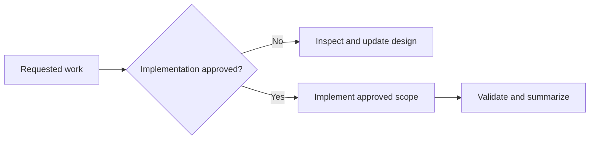

# AGENTS.md

## Scope and mode

These instructions apply to this repository. Karate and WikiCS are verified on
the laptop and on private Kaggle T4 CUDA jobs. Matching Kaggle CPU-only jobs
pass the prediction-parity gate. A larger Flickr CPU/T4 benchmark is the current
validation target. Kaggle GPU predictions pass checksum-checked local Neo4j
import. H200 and production Neo4j remain design-only.

Without explicit approval, do not install or remove software, alter shell or OS
configuration, start services or containers, create database data, or modify the
future data-center platform. Read-only inspection, research, and Markdown edits
are allowed.

## Current direction

- Share device-neutral PyTorch, PyTorch Geometric, tensor, and checkpoint logic.
- Select CUDA, MPS, or CPU at runtime; Metal does not implement the CUDA API.
- Keep each POC device-neutral and use ready environment profile files.
- Keep Kaggle GPU jobs database-free; move only versioned prediction artifacts
  and detached SHA-256 files back to the local Neo4j importer.
- Keep Kaggle CPU and GPU comparisons model-identical and require at least 95%
  node-class agreement; do not import CPU comparison artifacts into Neo4j.
- Use POCs 7 and 8 only for a model-identical, training-timed Flickr GraphSAGE
  comparison; these artifacts are comparison-only and never enter Neo4j.
- Keep Mac Python host-native so PyTorch can use MPS.
- Use Apple Container for the verified local Neo4j proof.
- Pin Neo4j and workload images to explicit versions.
- Keep Neo4j separate from GPU training.
- Run production on self-managed Linux systems in one data center: an H200
  cluster plus a separate Neo4j database tier.
- Prefer a separate x86-64 Linux NVIDIA workstation for local CUDA development.
- Buy the local NVIDIA GPU new with an official Indonesian warranty; exclude
  used, refurbished, ex-display, repaired, and import-only units.
- Treat every ADR marked `Proposed` as undecided.

## Current laptop

- Apple M2 Pro MacBook Pro with 16 GB memory.
- Homebrew Python 3.14.7 and a project `.venv` are active for the POC.
- The local POCs pin PyTorch 2.14.0, PyG 2.8.0.post1, and Neo4j Driver 6.3.0.
- MPS and CPU profiles pass locally; both CUDA artifact proofs pass on Kaggle T4.
- Temurin 21 and 25 are installed; interactive shells select Temurin 25.
- No Homebrew OpenJDK formula or `uv` is installed.
- Homebrew Apple Container 1.3.1 runs Neo4j Community 2026.07.1 as Linux ARM64.
- The `neo4j-poc` container uses 2 CPUs, 2 GB memory, and a 4 GB named volume.
- Local transaction-log retention is capped at 256 MB for repeated POC reloads.
- Bolt is published only on `127.0.0.1:7687`; authentication stays untracked.
- Bun-based PDF tooling and project-local Playwright Chromium are available.

## Verified Kaggle learnings

- Kaggle CPU-only kernels work with `enable_gpu=false`; the runner must also
  fail if CUDA is unexpectedly available so the result proves CPU execution.
- Karate CPU and T4 predictions agree on 100% of nodes. WikiCS agrees on
  97.7523% of nodes, with 79.01% CPU and 79.32% T4 test accuracy. Floating-point
  scores need not be bit-identical across devices.
- Compare the base PyTorch release separately from its build suffix: Kaggle CPU
  reports `+cpu`, while T4 reports `+cu128` for the same release.
- Small Karate and WikiCS artifacts prove portability but contain no
  training-only timing, so they cannot establish a GPU speed benefit.
- For a newly created Kaggle kernel, the title-derived slug must match the
  metadata `id`; use the canonical ID returned by the first push.
- In the current Kaggle T4 image, passing a `torch.device` to CUDA peak-memory
  reset produced `Invalid device argument`. Calling peak-memory reset and read
  for the active device without an explicit argument works around that API
  behavior.
- Put downloads, extracted source, and datasets under `/kaggle/temp`; write only
  final artifacts and checksums under `/kaggle/working`.
- Pin each wrapper to the commit containing executable code. A later pin-only
  commit is expected and must not replace the executable revision recorded in
  the artifact specification.
- Kaggle failures must be diagnosed from the downloaded kernel log, fixed in a
  new commit, repinned, and rerun. Never treat a submitted or running kernel as
  a successful proof.

## Documentation rules

- Keep documents concise and organized under `docs/NN-topic/`.
- State current conditions, current direction, constraints, and open decisions;
  omit procedural history unless it is essential evidence.
- Use Mermaid only when it clarifies architecture or decision flow.
- Every ADR includes status, decision, and consequences.
- Label proposed work clearly and attach observation dates to version-sensitive
  facts.
- Prefer official PyTorch, PyG, Neo4j, Apple, and NVIDIA sources.
- Never record secrets, private identifiers, or credentials.

## Data safety

- Keep credentials in untracked environment files or a secret manager.
- Neo4j requires explicit persistent storage and a tested backup/restore plan.
- Preserve user data and unrelated workspace changes.
- Implementation approval is limited to the exact requested scope.
