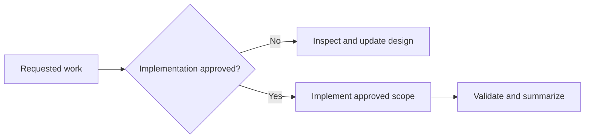

# AGENTS.md

## Scope and mode

These instructions apply to this repository. All fourteen POCs pass. Karate and
WikiCS are verified on the laptop and private Kaggle CPU/T4 jobs. Both Flickr
256, 1,024, 2,048, and 4,096 comparisons pass. Kaggle GPU predictions for
Karate and WikiCS pass checksum-checked local Neo4j import. H200 and production
Neo4j remain design-only. Every logical workload has a committed
three-environment comparison covering host-native MPS, Kaggle CPU only, and one
Kaggle Tesla T4.

Without explicit approval, do not install or remove software, alter shell or OS
configuration, start services or containers, create database data, or modify the
future data-center platform. Read-only inspection, research, and Markdown edits
are allowed.

## Current direction

- Share device-neutral PyTorch, PyTorch Geometric, tensor, and checkpoint logic.
- Select CUDA, MPS, or CPU at runtime; Metal does not implement the CUDA API.
- Keep each POC device-neutral and use ready environment profile files.
- Keep Kaggle GPU jobs database-free; move only versioned prediction artifacts
  and detached SHA-256 files back to the local Neo4j importer.
- Keep Kaggle CPU and GPU comparisons model-identical and require at least 95%
  node-class agreement; do not import CPU comparison artifacts into Neo4j.
- Keep MPS, Kaggle CPU, and Kaggle T4 artifacts model-identical for each logical
  workload. Require at least 95% agreement for all three environment pairs and
  keep the consolidated result under `results/`.
- Use POCs 7 and 8 only for a model-identical, training-timed Flickr GraphSAGE
  comparison; these artifacts are comparison-only and never enter Neo4j.
- Use POCs 9 and 10 for the wider 1,024-channel Flickr comparison. Require the
  T4 run to allocate at least 4 GiB and record peak allocated, peak reserved,
  and total device memory; keep both artifacts comparison-only.
- Use POCs 11 and 12 for the 2,048-channel Flickr comparison. Keep exact
  262,144-edge mean-aggregation chunks and the pure-PyTorch bounded-backward
  rule model-identical on MPS, CPU, and T4. Require at least 8 GiB T4 peak
  allocation; keep all artifacts comparison-only.
- Use POCs 13 and 14 for the 4,096-channel Flickr comparison. Keep exact mean
  aggregation and pure-PyTorch activation checkpointing everywhere. Record
  backend workspace size as execution metadata: 32,768 edges on MPS and
  131,072 on Kaggle CPU/T4. Require at least 10 GiB T4 peak allocation.
- POCs 15 and 16 are the pending 8,192-channel Flickr comparison. Keep full
  FP32 training, exact destination-node-chunked mean aggregation, hidden- and
  output-layer checkpointing, and CPU-retained best state identical across
  environments. Workspace sizes may differ and must be recorded. Require at
  least 12 GiB T4 peak allocation.
- Use a single Tesla T4 as the fixed Kaggle GPU baseline. Keep T4x2 open for a
  future explicitly multi-GPU POC; do not use P100 or another accelerator
  without explicit approval.
- Keep Mac Python host-native so PyTorch can use MPS.
- Use Apple Container for the verified local Neo4j proof.
- Pin Neo4j and workload images to explicit versions.
- Keep Neo4j separate from GPU training.
- Run production on self-managed Linux systems in one data center: an H200
  cluster plus a separate Neo4j database tier.
- Prefer a separate x86-64 Linux NVIDIA workstation for local CUDA development.
- Run `bun run cuda:validate` before introducing native CUDA dependencies. Treat
  `UNKNOWN`, `REBUILD_REQUIRED`, and `CUSTOM_BUILD_REQUIRED` as review gates for
  the H200 `sm_90` and local RTX Blackwell `sm_120` targets.
- Buy the local NVIDIA GPU new with an official Indonesian warranty; exclude
  used, refurbished, ex-display, repaired, and import-only units.
- Treat every ADR marked `Proposed` as undecided.

## Current laptop

- Apple M2 Pro MacBook Pro with 16 GB memory.
- Homebrew Python 3.14.7 and a project `.venv` are active for the POC.
- The local POCs pin PyTorch 2.14.0, PyG 2.8.0.post1, Neo4j Driver 6.3.0, and
  SciPy 1.18.1 for Flickr dataset processing.
- MPS and CPU profiles pass locally; all twelve Kaggle CPU/T4 jobs pass.
- Temurin 21 and 25 are installed; interactive shells select Temurin 25.
- No Homebrew OpenJDK formula or `uv` is installed.
- Homebrew Apple Container 1.3.1 runs Neo4j Community 2026.07.1 as Linux ARM64.
- The `neo4j-poc` container uses 2 CPUs, 2 GB memory, and a 4 GB named volume.
- Local transaction-log retention is capped at 256 MB for repeated POC reloads.
- Bolt is published only on `127.0.0.1:7687`; authentication stays untracked.
- Bun-based PDF tooling and project-local Playwright Chromium are available.

## Verified Kaggle learnings

- Kaggle CPU-only kernels work with `enable_gpu=false`; the runner must also
  fail if CUDA is unexpectedly available so the result proves CPU execution.
- Karate CPU and T4 predictions agree on 100% of nodes. WikiCS agrees on
  97.7523% of nodes, with 79.01% CPU and 79.32% T4 test accuracy. Floating-point
  scores need not be bit-identical across devices.
- Compare the base PyTorch release separately from its build suffix: Kaggle CPU
  reports `+cpu`, while T4 reports `+cu128` for the same release.
- Small Karate and WikiCS artifacts prove portability but contain no
  training-only timing, so they cannot establish a GPU speed benefit.
- The latest Flickr GraphSAGE proof used a four-core Intel Xeon CPU: 246.06
  training seconds versus 6.31 seconds on Tesla T4, a 38.974x speedup, with
  98.7395% class agreement. Kaggle CPU hardware varies; an earlier AMD EPYC run
  took 186.15 seconds, so comparisons must record the assigned CPU model.
- Linux `wait4` measured 2.94 GB peak resident memory and 160.267% average
  process CPU across the complete CPU runner. The percentage is an average
  equivalent to about 1.60 busy cores, not peak utilization.
- Wide Flickr uses 1,024 hidden channels and 3,137,543 parameters. It measured
  599.42 CPU training seconds versus 17.17 T4 seconds, a 34.915x speedup, with
  99.9003% class agreement.
- Wide Flickr measured 6.88 GB peak T4 allocation and 9.76 GB peak reservation
  from 15.64 GB capacity. Its four-core AMD EPYC CPU run measured 8.01 GB peak
  RSS, 660.25 seconds complete-runner wall time, and 169.281% average process
  CPU. CUDA allocator memory and CPU RSS are not directly equivalent.
- All six workload triplets pass checksum and schema validation. Pairwise class
  agreement ranges from 97.7523% to 100% across MPS, Kaggle CPU, and T4.
- Flickr-256 trained in 38.10 seconds on MPS, 246.06 seconds on Kaggle CPU, and
  6.31 seconds on T4. Flickr-1,024 took 158.84, 599.42, and 17.17 seconds.
- Flickr-2,048 uses 10,469,383 parameters and exact chunked mean aggregation.
  It trained in 576.98 seconds on MPS, 1,521.33 seconds on Kaggle CPU, and 56.58
  seconds on T4. All pairs agreed on at least 99.8723% of predicted classes.
- Flickr-2,048 measured 12.13 GB CPU peak RSS and 10.35 GB T4 peak allocation;
  T4 peak reservation was 13.90 GB of 15.64 GB total memory. The pure-PyTorch
  custom autograd rule is portable tensor code, not a compiled CUDA extension.
- Flickr-4,096 uses 37,715,975 parameters, exact chunked aggregation, and
  activation checkpointing. It trained in 448.47 seconds on MPS, 6,828.02
  seconds on Kaggle CPU, and 177.87 seconds on T4. All pairs agreed on at least
  99.2807% of predicted classes.
- Flickr-4,096 measured 11.72 GB CPU peak RSS and 11.10 GB T4 peak allocation;
  T4 peak reservation was 15.25 GB of 15.64 GB total memory. Treat 97.51%
  reservation as close to the practical one-T4 allocator limit.
- Standard free Kaggle notebooks document 4 CPU cores and 30 GB RAM. GPU choices
  document one P100 or two T4s with 4 CPU cores and 29 GB host RAM; accelerator
  availability and quota are variable.
- The current default Kaggle PyTorch `cu128` image cannot execute on P100
  `sm_60`. Stay with T4; do not spend quota testing a Pascal-compatible build.
- For a newly created Kaggle kernel, the title-derived slug must match the
  metadata `id`; use the canonical ID returned by the first push.
- In the current Kaggle T4 image, passing a `torch.device` to CUDA peak-memory
  reset produced `Invalid device argument`. Calling peak-memory reset and read
  for the active device without an explicit argument works around that API
  behavior.
- The Kaggle CPU image does not provide `/usr/bin/time`. Measure the Python
  runner with Linux `wait4` resource usage instead; a submitted kernel that
  fails before training is not evidence and must be superseded by a passing
  immutable version.
- Put downloads, extracted source, and datasets under `/kaggle/temp`; write only
  final artifacts and checksums under `/kaggle/working`.
- Pin each wrapper to the commit containing executable code. A later pin-only
  commit is expected and must not replace the executable revision recorded in
  the artifact specification.
- Kaggle failures must be diagnosed from the downloaded kernel log, fixed in a
  new commit, repinned, and rerun. Never treat a submitted or running kernel as
  a successful proof.
- Committed CPU/GPU comparisons must show `proof_status=PASS`, checksum and
  schema validation, CPU `cuda_available=false`, T4 CUDA identity, matching
  dataset/model metadata, and version-specific Kaggle `COMPLETE` status.

## Documentation rules

- Keep documents concise and organized under `docs/NN-topic/`.
- State current conditions, current direction, constraints, and open decisions;
  omit procedural history unless it is essential evidence.
- Use Mermaid only when it clarifies architecture or decision flow.
- Every ADR includes status, decision, and consequences.
- Label proposed work clearly and attach observation dates to version-sensitive
  facts.
- Prefer official PyTorch, PyG, Neo4j, Apple, and NVIDIA sources.
- Never record secrets, private identifiers, or credentials.

## Data safety

- Keep credentials in untracked environment files or a secret manager.
- Neo4j requires explicit persistent storage and a tested backup/restore plan.
- Preserve user data and unrelated workspace changes.
- Implementation approval is limited to the exact requested scope.
