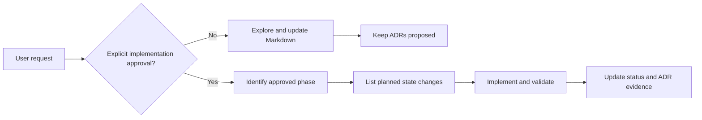

# AGENTS.md

## Scope

These instructions apply to the entire repository rooted at this directory.

## Current mode: exploration and design

This workspace is documentation-only until the user explicitly approves an
implementation phase.

Allowed without additional approval:

- inspect the laptop, repository, and installed tools with read-only commands;
- research architecture and compatibility using authoritative sources;
- create or revise Markdown documentation under `docs/`;
- create decision records as proposed ADRs;
- identify risks, alternatives, open questions, and acceptance criteria.

Do not do any of the following without explicit user approval:

- create application code, tests, notebooks, environment files, or lockfiles;
- install, update, or uninstall packages or system software;
- start, stop, configure, or remove Neo4j or another service;
- start Apple Container or create, pull, run, modify, or delete containers,
  images, networks, machines, or volumes;
- create database users, credentials, schemas, nodes, relationships, or data;
- alter shell profiles, global Git configuration, IDE settings, or OS settings;
- provision or modify the future NVIDIA H200 server.

## Read first

Before proposing work, read the relevant documents in this order:

1. `README.md`
2. `docs/00-status/current-state.md`
3. `docs/01-architecture/overview.md`
4. `docs/04-decisions/ADR-001-compute-portability.md`
5. `docs/04-decisions/ADR-002-neo4j-runtime.md`
6. `docs/04-decisions/ADR-003-production-topology.md`
7. `docs/04-decisions/ADR-004-local-nvidia-device.md`
8. The platform-specific document relevant to the task:
   - `docs/02-local-development/apple-silicon.md`
   - `docs/03-deployment/h200-server.md`
9. `docs/05-plan/phases.md`

## Established design direction

- Share device-neutral PyTorch tensors, model code, PyTorch Geometric data, and
  checkpoints between platforms.
- Metal/MPS does not implement the CUDA API.
- Develop with host-native Python on the Mac so PyTorch can access MPS.
- Use runtime device selection in the order CUDA, MPS, then CPU.
- Keep CUDA-only optimizations behind an optional H200-specific boundary.
- Keep Neo4j separate from the GPU training runtime.
- Evaluate Apple Container for local Neo4j isolation, not local GPU training.
- Pin Neo4j to explicit versions; never deploy an unversioned or `latest` image.
- Run the entire production platform in one self-managed data center.
- Treat the H200 fleet as a Linux cluster, with Neo4j on a separate Linux
  database tier in the same data center.
- Do not propose AuraDB or another cloud-managed production dependency unless
  the user explicitly reopens that decision.
- Prefer a separate x86-64 Linux NVIDIA workstation on the local network over an
  eGPU, NVIDIA laptop, or GPU-less Apple Container for CUDA development.
- Procure the local NVIDIA GPU new with an official Indonesian warranty; used,
  refurbished, and import-only units are outside the current design.
- Treat all ADRs marked `Proposed` as undecided until the user accepts them.

## Documentation conventions

- Keep documents tiered by concern under `docs/NN-topic/`.
- Use Mermaid diagrams for architecture, decision flows, and multi-stage plans
  when they make relationships clearer; keep detailed facts in prose or tables.
- Use ADRs for decisions with meaningful alternatives or consequences.
- Every ADR must include status, context, decision, and consequences.
- Mark unexecuted commands and workflows as proposed; never imply they were
  tested.
- Record observed versions with the observation date because tool and framework
  support changes over time.
- Prefer primary sources: official PyTorch, PyTorch Geometric, Neo4j, Apple, and
  NVIDIA documentation.
- Keep commands free of real passwords, tokens, hostnames, account IDs, and
  private repository URLs.

## Security and data safety

- Never place secrets in Markdown, tracked files, command arguments, or shell
  history.
- Plan for untracked environment files or a secret manager during implementation.
- Neo4j persistence must use an explicit volume and include backup/restore design
  before important data is introduced.
- Do not delete Homebrew packages, containers, volumes, databases, or user data
  merely to make the environment match a proposal.

## Current observed caveats

- Homebrew `uv`, Neo4j Community Edition, `cypher-shell`, and `openjdk@21` were
  installed before design-only mode and later removed at the user's request;
  Neo4j was never started and no database data was created.
- Temurin 25 is installed and must be preserved. Temurin 21 is also installed,
  while the persistent `JAVA_HOME` in `~/.zshrc` selects Temurin 25.
- No Homebrew OpenJDK formula remains. Maven and `jdtls` are still installed and
  declare Homebrew OpenJDK as a dependency, so Homebrew may reinstall it during
  a future install or upgrade. Maven has been verified with Temurin 25.
- Apple Container CLI 0.11.0 is installed but has not been started or modified;
  upstream compatibility and upgrade implications must be reviewed before use.
- The laptop has 16 GB of memory, so any future Neo4j container or VM needs
  conservative resource limits alongside local GNN development.

## Approval handoff

When implementation is requested, first identify the exact phase from
`docs/05-plan/phases.md`, list its planned state changes, and confirm any decision
that is still marked `Proposed`. After implementation, update the current-state
document and the relevant ADR status with evidence from actual validation.
