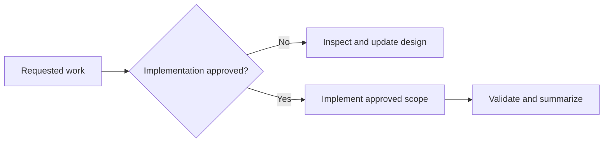

# AGENTS.md

## Scope and mode

These instructions apply to this repository. The minimal local Python, MPS GNN,
and Neo4j proof is implemented and verified. The H200 and production Neo4j
environments remain design-only.

Without explicit approval, do not install or remove software, alter shell or OS
configuration, start services or containers, create database data, or modify the
future data-center platform. Read-only inspection, research, and Markdown edits
are allowed.

## Current direction

- Share device-neutral PyTorch, PyTorch Geometric, tensor, and checkpoint logic.
- Select CUDA, MPS, or CPU at runtime; Metal does not implement the CUDA API.
- Keep training in one shared runner and use ready environment profile files.
- Keep Mac Python host-native so PyTorch can use MPS.
- Use Apple Container for the verified local Neo4j proof.
- Pin Neo4j and workload images to explicit versions.
- Keep Neo4j separate from GPU training.
- Run production on self-managed Linux systems in one data center: an H200
  cluster plus a separate Neo4j database tier.
- Prefer a separate x86-64 Linux NVIDIA workstation for local CUDA development.
- Buy the local NVIDIA GPU new with an official Indonesian warranty; exclude
  used, refurbished, ex-display, repaired, and import-only units.
- Treat every ADR marked `Proposed` as undecided.

## Current laptop

- Apple M2 Pro MacBook Pro with 16 GB memory.
- Homebrew Python 3.14.7 and a project `.venv` are active for the POC.
- The POC pins PyTorch 2.14.0, PyG 2.8.0.post1, and Neo4j Driver 6.3.0.
- MPS and CPU profiles pass locally; the Linux CUDA profile awaits NVIDIA validation.
- Temurin 21 and 25 are installed; interactive shells select Temurin 25.
- No Homebrew OpenJDK formula or `uv` is installed.
- Homebrew Apple Container 1.3.1 runs Neo4j Community 2026.07.1 as Linux ARM64.
- The `neo4j-poc` container uses 2 CPUs, 2 GB memory, and a 2 GB named volume.
- Bolt is published only on `127.0.0.1:7687`; authentication stays untracked.
- Bun-based PDF tooling and project-local Playwright Chromium are available.

## Documentation rules

- Keep documents concise and organized under `docs/NN-topic/`.
- State current conditions, current direction, constraints, and open decisions;
  omit procedural history unless it is essential evidence.
- Use Mermaid only when it clarifies architecture or decision flow.
- Every ADR includes status, decision, and consequences.
- Label proposed work clearly and attach observation dates to version-sensitive
  facts.
- Prefer official PyTorch, PyG, Neo4j, Apple, and NVIDIA sources.
- Never record secrets, private identifiers, or credentials.

## Data safety

- Keep credentials in untracked environment files or a secret manager.
- Neo4j requires explicit persistent storage and a tested backup/restore plan.
- Preserve user data and unrelated workspace changes.
- Implementation approval is limited to the exact requested scope.
