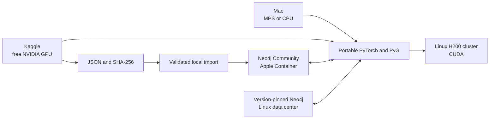

# GNN and Neo4j environment

## Current summary

Four proofs use two datasets across two compute environments. The laptop runs
Karate and WikiCS on MPS or CPU with local Neo4j. Two private Kaggle jobs run the
same device-neutral models on a free NVIDIA GPU, export checksummed predictions,
and leave Neo4j on the laptop. Production remains a design for a self-managed
Linux H200 cluster and separate Neo4j tier in one data center.



Ready files select the compute profile without embedding MPS or CUDA calls in
the model code:

```bash
# Minimal Karate proof
./poc/run_macos_mps.py
./poc/run_cpu.py
./poc/run_linux_cuda.py

# Larger WikiCS proof
./poc/run_wikics_macos_mps.py
./poc/run_wikics_cpu.py
./poc/run_wikics_linux_cuda.py

# CUDA-only artifact exporters; execute these through the Kaggle kernels
./poc/run_kaggle_karate_cuda.py
./poc/run_kaggle_wikics_cuda.py
```

MPS and CPU are verified for both POCs on this laptop. CUDA entry points are
ready for later NVIDIA validation. Each executable automatically uses the
project `.venv` when present. `bun run poc:verify` and
`bun run poc:wikics:verify` perform read-only database checks.
The latest committed execution summaries are indexed in
[`results/README.md`](results/README.md).
Regenerate all project PDFs with `bun run md:pdf:all`; output is written under
`pdf/` with the Markdown directory structure preserved.

## Documents

| Core | Decisions and validation |
| --- | --- |
| [Current laptop state](docs/00-status/current-state.md) | [Compute portability](docs/04-decisions/ADR-001-compute-portability.md) |
| [Architecture summary](docs/01-architecture/overview.md) | [Local Neo4j runtime](docs/04-decisions/ADR-002-neo4j-runtime.md) |
| [Apple Silicon development](docs/02-local-development/apple-silicon.md) | [Production topology](docs/04-decisions/ADR-003-production-topology.md) |
| [H200 cluster design](docs/03-deployment/h200-server.md) | [Local NVIDIA device](docs/04-decisions/ADR-004-local-nvidia-device.md) |
| [Implementation phases](docs/05-plan/phases.md) | [Minimal local proof](docs/06-validation/minimal-local-poc.md) |
|  | [Larger WikiCS proof](docs/06-validation/larger-wikics-poc.md) |
|  | [Kaggle CUDA proofs](docs/06-validation/kaggle-cuda-pocs.md) |
