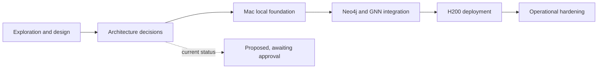

# GNN + Neo4j environment design

This workspace is currently documentation-only. No project environment,
database service, container, model code, or configuration has been created.

## Design index

1. [Current laptop state](docs/00-status/current-state.md)
2. [Proposed system architecture](docs/01-architecture/overview.md)
3. [Apple Silicon development design](docs/02-local-development/apple-silicon.md)
4. [NVIDIA H200 deployment design](docs/03-deployment/h200-server.md)
5. [Decision: portable tensors vs CUDA APIs](docs/04-decisions/ADR-001-compute-portability.md)
6. [Decision: how to run Neo4j locally](docs/04-decisions/ADR-002-neo4j-runtime.md)
7. [Decision: self-managed production topology](docs/04-decisions/ADR-003-production-topology.md)
8. [Decision: local NVIDIA development device](docs/04-decisions/ADR-004-local-nvidia-device.md)
9. [Future implementation phases](docs/05-plan/phases.md)

Status: exploration and design. The decision records are proposals until the
user approves implementation.
