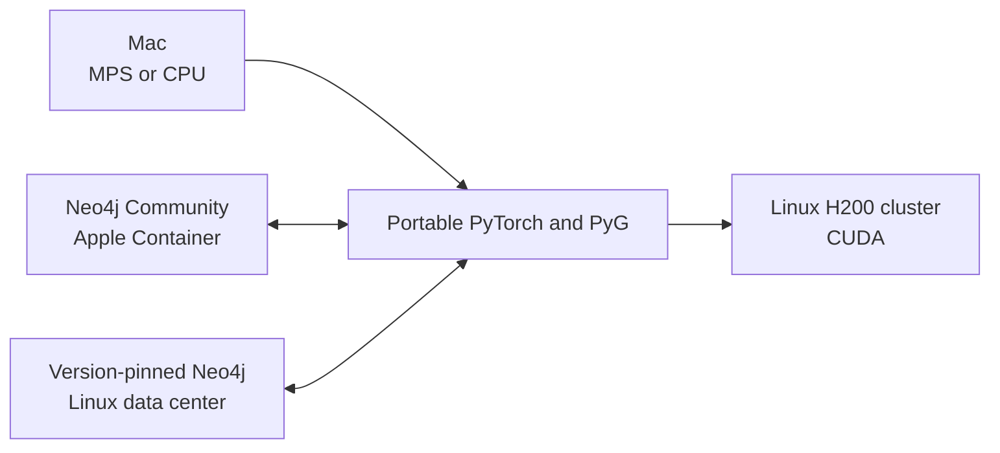

# GNN and Neo4j environment

## Current summary

The smallest local workflow is implemented and verified on Apple Silicon:
host-native PyTorch/PyG trains a one-layer GCN on MPS while Neo4j Community runs
as a version-pinned Linux ARM64 Apple Container. Production remains a design for
a self-managed Linux H200 cluster and a separate Neo4j tier in one data center.



The verified POC uses the bundled 34-node Karate Club dataset, a single
`GCNConv(34, 4)`, and a Neo4j round trip. Ready entry points select the correct
shared-runner profile:

```bash
./poc/run_macos_mps.py
./poc/run_cpu.py
./poc/run_linux_cuda.py
```

MPS and CPU are verified on this laptop. The CUDA entry point is ready for later
NVIDIA validation. Each executable automatically uses the project `.venv` when
present. `bun run poc:verify` performs a read-only database check.
Regenerate all project PDFs with `bun run md:pdf:all`; output is written under
`pdf/` with the Markdown directory structure preserved.

## Documents

| Core | Decisions and validation |
| --- | --- |
| [Current laptop state](docs/00-status/current-state.md) | [Compute portability](docs/04-decisions/ADR-001-compute-portability.md) |
| [Architecture summary](docs/01-architecture/overview.md) | [Local Neo4j runtime](docs/04-decisions/ADR-002-neo4j-runtime.md) |
| [Apple Silicon development](docs/02-local-development/apple-silicon.md) | [Production topology](docs/04-decisions/ADR-003-production-topology.md) |
| [H200 cluster design](docs/03-deployment/h200-server.md) | [Local NVIDIA device](docs/04-decisions/ADR-004-local-nvidia-device.md) |
| [Implementation phases](docs/05-plan/phases.md) | [Minimal local proof](docs/06-validation/minimal-local-poc.md) |
