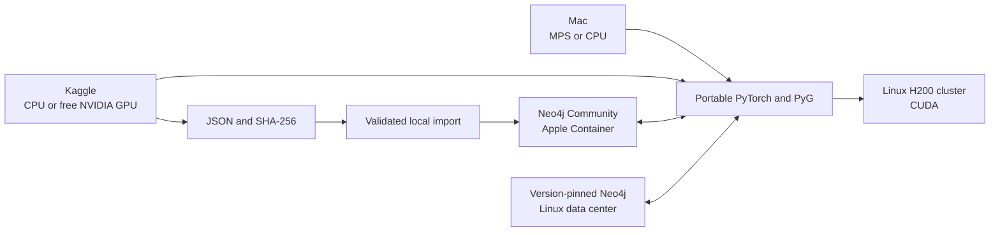

# GNN and Neo4j environment

## Current summary

Eight verified proofs and two ready high-memory proofs use three datasets across
laptop and Kaggle compute. The laptop runs
Karate and WikiCS on MPS or CPU with local Neo4j. Private Kaggle jobs run the
same models on CPU and a free NVIDIA GPU, export checksummed predictions, and
leave Neo4j on the laptop. A larger Flickr GraphSAGE CPU/T4 benchmark is the
timed comparison and shows a 38.974x T4 speedup. POCs 9 and 10 widen that model
to 1,024 channels for a higher-memory CPU/T4 comparison. Production remains a
design for a self-managed Linux H200 cluster and separate Neo4j tier.



Ready files select the compute profile without embedding MPS or CUDA calls in
the model code:

```bash
# Minimal Karate proof
./poc/run_macos_mps.py
./poc/run_cpu.py
./poc/run_linux_cuda.py

# Larger WikiCS proof
./poc/run_wikics_macos_mps.py
./poc/run_wikics_cpu.py
./poc/run_wikics_linux_cuda.py

# Database-free artifact exporters; execute through the Kaggle kernels
./poc/run_kaggle_karate_cuda.py
./poc/run_kaggle_wikics_cuda.py
./poc/run_kaggle_karate_cpu.py
./poc/run_kaggle_wikics_cpu.py
./poc/run_kaggle_flickr_cpu.py
./poc/run_kaggle_flickr_cuda.py
./poc/run_kaggle_flickr_wide_cpu.py
./poc/run_kaggle_flickr_wide_cuda.py
```

MPS and CPU are verified for both laptop POCs. Both Kaggle CUDA proofs pass on
Tesla T4 and their predictions are imported locally. The Linux CUDA profiles
remain ready for later H200 validation. Each executable automatically uses the
project `.venv` when present. `bun run poc:verify` and
`bun run poc:wikics:verify` perform read-only database checks.
The latest committed execution summaries are indexed in
[`results/README.md`](results/README.md).
Regenerate all project PDFs with `bun run md:pdf:all`; output is written under
`pdf/` with the Markdown directory structure preserved.

Run `bun run cuda:validate` to detect project-owned CUDA/C++ compilation paths
and write ignored JSON and Markdown reports for the planned H200 `sm_90` and
local RTX Blackwell `sm_120` targets.

## Documents

| Core | Decisions and validation |
| --- | --- |
| [Current laptop state](docs/00-status/current-state.md) | [Compute portability](docs/04-decisions/ADR-001-compute-portability.md) |
| [Architecture summary](docs/01-architecture/overview.md) | [Local Neo4j runtime](docs/04-decisions/ADR-002-neo4j-runtime.md) |
| [Apple Silicon development](docs/02-local-development/apple-silicon.md) | [Production topology](docs/04-decisions/ADR-003-production-topology.md) |
| [H200 cluster design](docs/03-deployment/h200-server.md) | [Local NVIDIA device](docs/04-decisions/ADR-004-local-nvidia-device.md) |
| [Implementation phases](docs/05-plan/phases.md) | [Minimal local proof](docs/06-validation/minimal-local-poc.md) |
|  | [Larger WikiCS proof](docs/06-validation/larger-wikics-poc.md) |
|  | [Kaggle CUDA proofs](docs/06-validation/kaggle-cuda-pocs.md) |
|  | [Kaggle CPU comparison](docs/06-validation/kaggle-cpu-comparison.md) |
|  | [Flickr CPU and GPU benchmark](docs/06-validation/flickr-kaggle-benchmark.md) |
|  | [Flickr wide CPU and GPU benchmark](docs/06-validation/flickr-wide-kaggle-benchmark.md) |
|  | [CUDA portability validator](docs/06-validation/cuda-portability-validator.md) |
