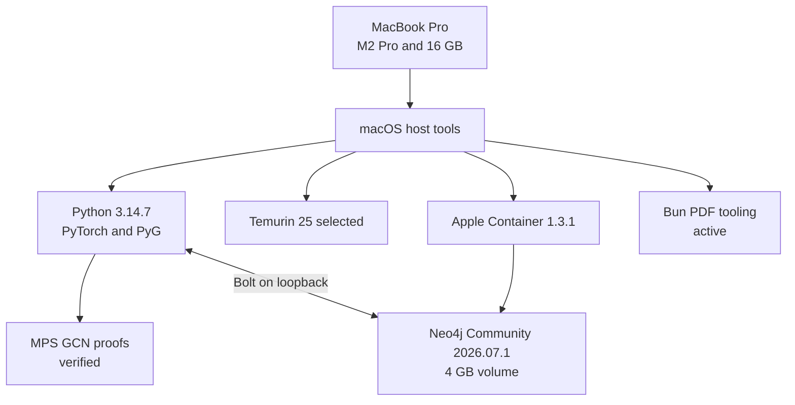

# Current laptop state

Observed and verified on 2026-09-05.

| Area | Current condition |
| --- | --- |
| Hardware | MacBook Pro, Apple M2 Pro, 16 GB memory |
| Operating system | macOS 26.6.2, ARM64 |
| Storage | Approximately 512 GiB free when observed |
| Homebrew | 6.0.21 |
| Python | 3.14.7 project `.venv`; dependency check passes |
| GNN | All eight laptop and Kaggle CPU/T4 POCs pass |
| Java | Temurin 21 and 25; interactive `JAVA_HOME` selects Temurin 25 |
| Apple Container | Homebrew CLI and service 1.3.1; active |
| Neo4j | Community 2026.07.1, Linux ARM64, running as `neo4j-poc` |
| Database resources | 2 CPUs, 2 GB memory, persistent 4 GB named volume |
| Transaction logs | Retention capped at 256 MB; 3.2 GB volume headroom after regression |
| Recovery snapshot | Original full 2 GB volume retained unmounted; safe to remove after review |
| Network | Bolt only at `127.0.0.1:7687` |
| Minimal POC | PASS: 34 nodes, 78 relationships, 34 predictions |
| Larger POC | PASS: 11,701 nodes, 216,123 relationships, 11,701 predictions |
| CUDA proofs | PASS on Tesla T4; 34 and 11,701 predictions imported locally |
| Kaggle CPU proofs | PASS: Karate 100% and WikiCS 97.75% class agreement with T4 |
| Larger Kaggle benchmark | PASS: Flickr T4 training is 29.485x faster than CPU |
| PDF tooling | Bun 1.4.1 with local Playwright, Chromium, Marked, and Mermaid |
| Constraints | 16 GB limit; MPS needs host Python; container needs Local Network access |

