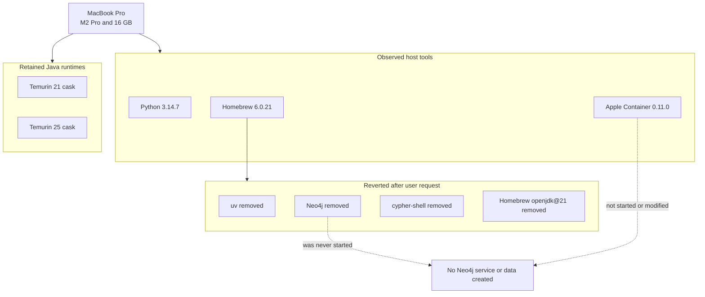

# Current laptop state

Observed on 2026-09-04. This is an inventory, not a target configuration.

| Item | Observed state |
| --- | --- |
| Hardware | MacBook Pro, Apple M2 Pro, 16 GB memory |
| Operating system | macOS 26.6.2, Apple Silicon ARM64 |
| Developer tools | Xcode selected; Git 2.55.0 |
| Homebrew | 6.0.21 |
| System Python | Homebrew Python 3.14.7 |
| Java | Temurin 21 and 25 casks; no Homebrew OpenJDK formula installed |
| Apple Container | CLI 0.11.0 at `/usr/local/bin/container` |
| Disk | Approximately 518 GiB available on `/` when inspected |

## Changes made and reverted around design-only mode

The following Homebrew formulas were installed before the instruction to stop
implementation and were later removed at the user's explicit request:

- `uv` 0.12.9: removed
- Neo4j Community Edition 2026.07.1: removed
- `cypher-shell` 2026.07.1: removed
- Homebrew `openjdk@21` 21.0.12.1: removed

Neo4j was never started, and no database service or data was created. Apple
Container was not started, updated, or used to create anything.

Temurin 25 version 25.0.4.1 remains installed as requested. Temurin 21 also
remains installed as a Homebrew cask. The persistent `JAVA_HOME` assignment in
`~/.zshrc` now selects Temurin 25, and a fresh interactive login shell plus Maven
3.9.16 were verified on Java 25.

Homebrew OpenJDK 26.0.2.1 was subsequently force-removed at the user's explicit
request. Maven 3.9.16 was verified to run with Temurin 25. Homebrew still declares
OpenJDK as a dependency of both Maven and `jdtls`, so a future Homebrew install or
upgrade of those formulas may reinstall OpenJDK. The `jdtls` launch check could
not complete in the restricted agent environment because Eclipse attempted to
write its configuration beneath the user home directory.
