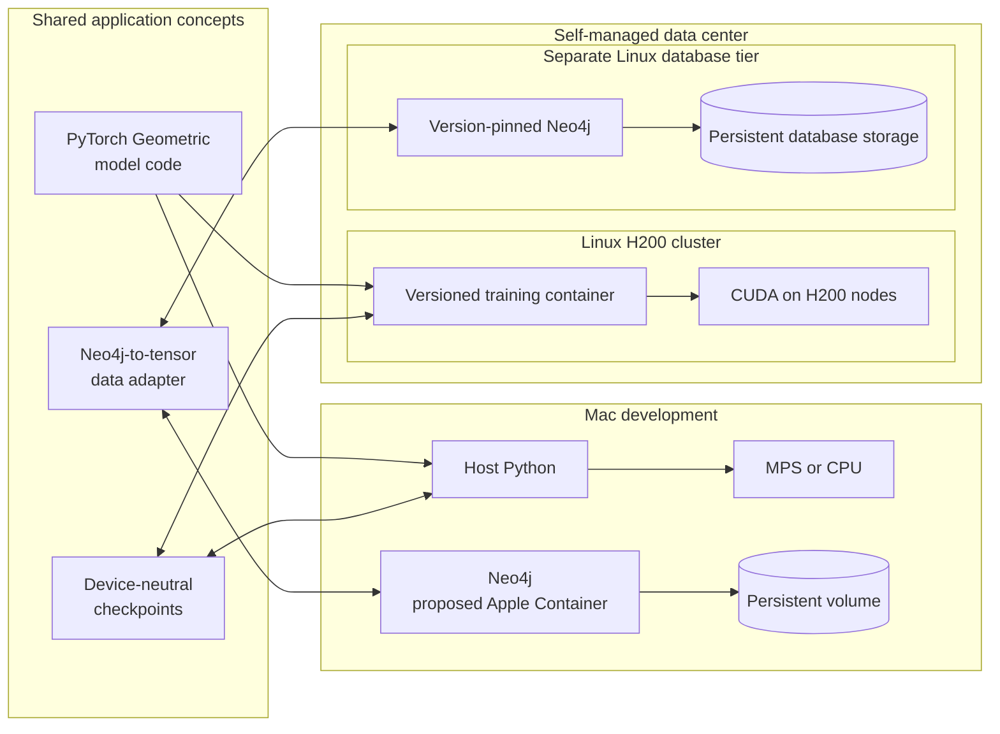
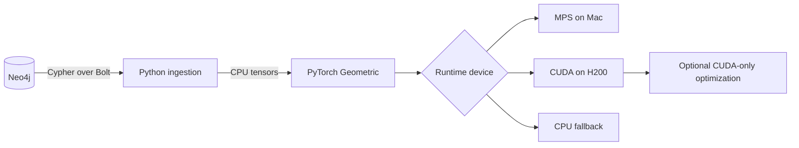

# Proposed system architecture

## Recommendation

Use a hybrid design with one portable Python codebase and platform-specific
runtime layers:

The Apple Container choice for local Neo4j is still proposed, not accepted.
Native Homebrew Neo4j remains a simpler fallback.

The production target is confirmed as a single self-managed data center. The
H200 compute cluster and Neo4j database tier both run on Linux and communicate
over the internal data-center network. Neo4j releases are pinned explicitly.

## Boundaries

- Neo4j owns durable graph data, indexes, constraints, and graph queries.
- The Python data layer converts query results into CPU tensors.
- PyTorch Geometric owns sampling, message passing, training, and inference.
- A device adapter moves tensors and models to MPS, CUDA, or CPU.
- CUDA-only optimization belongs behind an optional server-specific boundary.

## Why not put everything in Apple Container?

The Mac's Apple Container runtime does not currently provide GPU passthrough to
Linux containers. PyTorch inside it would therefore lose access to MPS and train
on CPU. Host-native Python is the better local training environment.

## Why not run Neo4j on the H200 GPU nodes?

Neo4j is primarily a CPU, memory, and storage workload. The H200 should be
reserved for tensor computation. Production places the self-managed Neo4j
service on a separate Linux database tier in the same data center.
