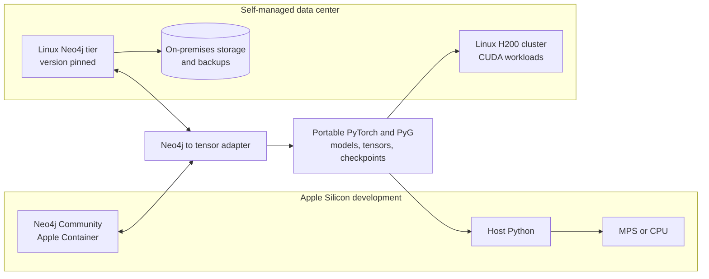

# Architecture summary

## Current direction

Use one portable PyTorch/PyG codebase with platform-specific runtime adapters.
Develop on macOS with MPS or CPU and run production workloads on CUDA in the
self-managed Linux H200 cluster. Keep Neo4j on a separate database tier.

## Boundaries

- Neo4j owns durable graph data, indexes, constraints, and Cypher queries.
- Python converts query results into CPU tensors.
- PyTorch Geometric owns sampling, message passing, training, and inference.
- A device adapter selects CUDA, MPS, or CPU.
- CUDA-only kernels, NCCL, and H200 optimizations remain optional.

## Validation ladder

| POC | Compute | Data and database boundary |
| --- | --- | --- |
| 1 | Laptop MPS or CPU | Karate round trip through local Neo4j |
| 2 | Laptop MPS or CPU | Pinned WikiCS round trip through local Neo4j |
| 3 | Kaggle NVIDIA CUDA | Karate predictions exported; local Neo4j import |
| 4 | Kaggle NVIDIA CUDA | WikiCS predictions exported; local Neo4j import |

All four keep compute selection outside model definitions. Kaggle receives no
database credential and runs no Neo4j process.

## Open decisions

- Production Python and framework versions.
- H200 scheduler, storage, network, and node topology.
- Neo4j edition and production clustering model.
- Local NVIDIA workstation purchase.
