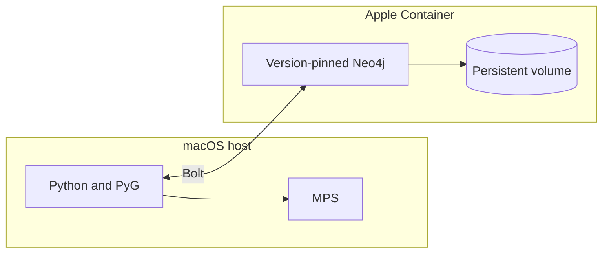

# Apple Silicon development summary

## Verified local setup

| Concern | Direction |
| --- | --- |
| Python | Host-native 3.14.7 `.venv` |
| Compute | PyTorch 2.14.0; MPS and CPU profiles verified |
| GNN | PyG 2.8.0.post1; one `GCNConv(34, 4)` |
| Neo4j | Community 2026.07.1 in Apple Container 1.3.1 |
| Memory | Neo4j limited to 2 GB on the 16 GB laptop |
| Status | End-to-end proof passed on 2026-09-05 |

Metal/MPS does not provide the CUDA API. Apple Container has no GPU role, so GNN
compute remains on the macOS host. The proof keeps model parameters, graph
tensors, and output on MPS with CPU fallback disabled.

Run `./poc/run_macos_mps.py` for accelerated local work or
`./poc/run_cpu.py` for the CPU control profile. Both call the same shared runner.

## Local Neo4j state

- Native Linux ARM64 image with an explicit version.
- Bolt is the only published port and binds to `127.0.0.1:7687`.
- `/data` uses the 2 GB `neo4j-poc-data` named volume.
- The graph survived container deletion and recreation.
- Authentication and telemetry opt-outs use an ignored mode-0600 environment
  file.
- macOS Local Network permission is enabled for `container-runtime-linux`.
