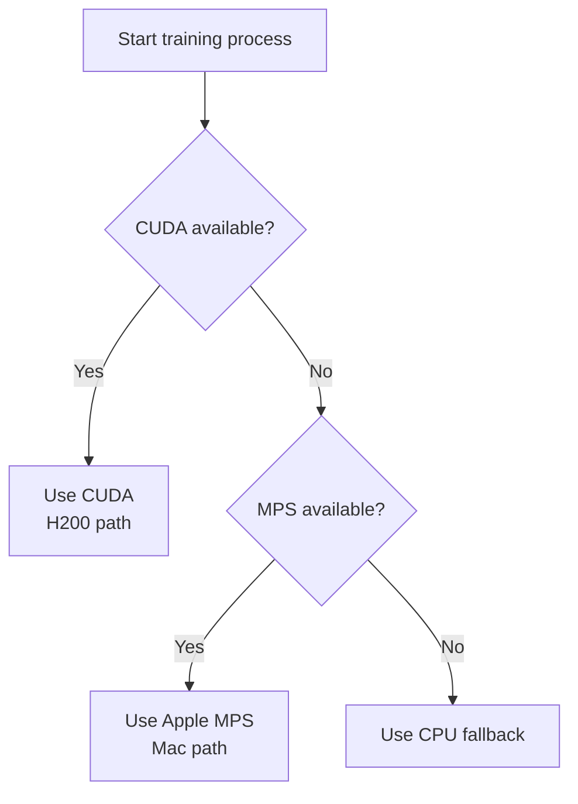
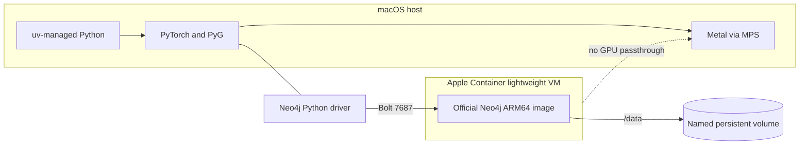
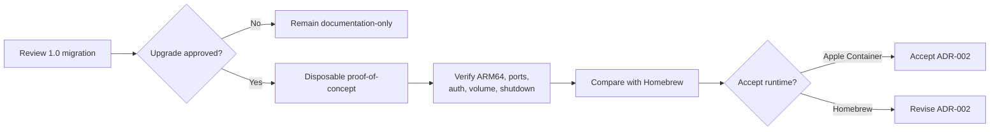

# Apple Silicon development design

## Compute

Use PyTorch's `mps` backend directly on macOS. MPS translates supported PyTorch
operations to Apple's Metal Performance Shaders. It is not a CUDA compatibility
layer and it does not implement the CUDA API.

Preferred device order in future code:

1. CUDA, when running on the H200 server.
2. MPS, when running on this Mac.
3. CPU as the universal fallback.

Python 3.13 is the proposed project version even though the installed system
Python is 3.14. This avoids coupling the project to Homebrew's Python upgrades
and gives scientific packages a conservative compatibility target. `uv` would
manage the isolated interpreter and environment after approval.

## Neo4j with Apple Container

Apple Container is attractive for the local database because it:

- runs standard OCI images, including the official Neo4j ARM64 image;
- isolates Neo4j and Java from the host project;
- supports named volumes and bind mounts for durable `/data` storage;
- makes the database version explicit and replaceable.

Important constraints:

- the installed CLI is 0.11.0 while upstream has reached 1.0.0;
- no native Docker Compose workflow should be assumed;
- the project is younger than Docker/Podman, so operational behavior needs a
  small proof-of-concept before it becomes the default;
- Neo4j must use a named persistent volume mounted at `/data`;
- secrets must not be written into tracked Markdown or shell history;
- on a 16 GB Mac, Neo4j memory and its lightweight VM must be capped so local
  GNN work retains enough memory.

## Proposed validation, not yet executed

1. Review the Apple Container 1.0 upgrade and migration notes.
2. Update the CLI only after approval.
3. Start the container system and create a disposable Neo4j proof-of-concept.
4. Verify ARM64 image selection, port publication for 7474/7687, authentication,
   persistence across container replacement, and clean shutdown.
5. Compare idle memory, startup time, and data-path ergonomics with Homebrew
   Neo4j before accepting the runtime decision.

## Sources

- [Apple Container project](https://github.com/apple/container)
- [Apple Container volume documentation](https://github.com/apple/container/blob/main/docs/volumes.md)
- [Neo4j container documentation](https://neo4j.com/docs/operations-manual/current/docker/)
- [Neo4j persistent-volume documentation](https://neo4j.com/docs/operations-manual/current/docker/mounting-volumes/)
- [PyTorch MPS documentation](https://docs.pytorch.org/docs/stable/notes/mps.html)
