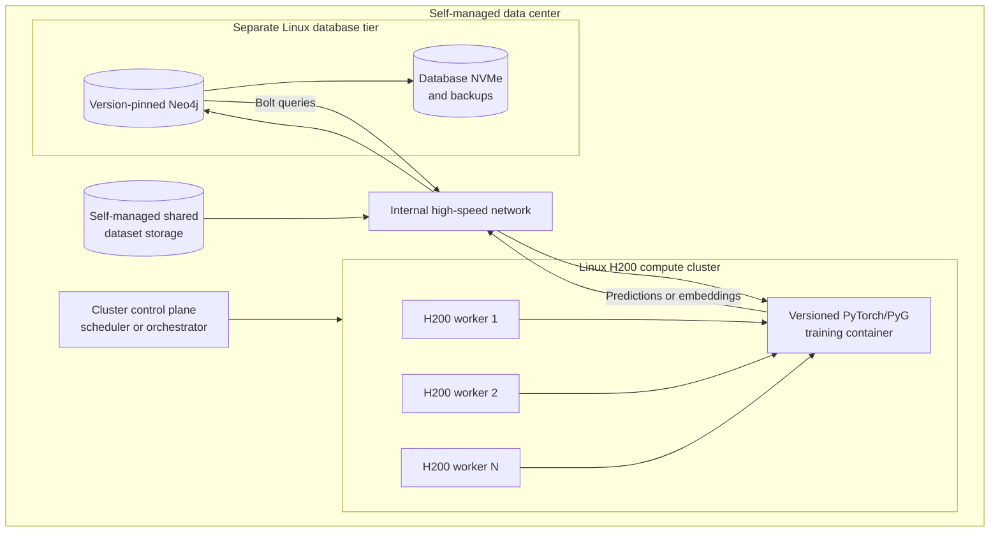
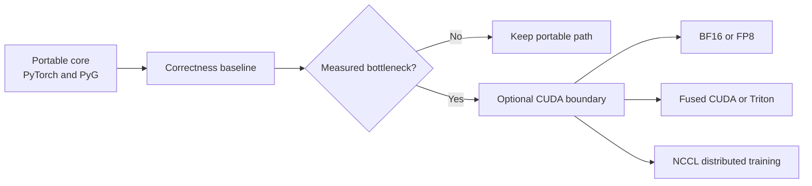

# Self-managed NVIDIA H200 cluster design

## Target runtime

The target is an on-premises, self-managed data center. Use a supported Linux
distribution, the NVIDIA data-center driver, NVIDIA Container Toolkit, and an
OCI runtime on every H200 worker. Apple Container is a macOS development tool
and is not the cluster runtime.

The workload scheduler or orchestrator remains open: for example, Slurm for an
HPC-oriented cluster or Kubernetes for a service-oriented platform. That choice
needs workload and operations requirements; it should not be guessed now.

The final PyTorch image and CUDA runtime version should be chosen when the server
is provisioned, based on the then-current PyTorch stable release and installed
NVIDIA driver. Do not freeze a guessed CUDA version now.

## Portability contract

The shared application should depend on ordinary PyTorch/PyG operations and a
small device abstraction. H200-specific features are optional accelerators:

- BF16 and mixed-precision training;
- FP8 where the chosen framework path supports it;
- distributed training with NCCL;
- fused or custom CUDA/Triton kernels;
- larger neighbor-sampling batches enabled by H200 memory.

These optimizations must not leak into the graph ingestion, feature engineering,
model definition, or checkpoint format unless there is a measured reason.

## Neo4j topology

Keep Neo4j out of the GPU training containers. The trainer connects to it over
Bolt on the internal data-center network. Neo4j runs self-managed on a separate
Linux CPU, memory, and storage tier. Cloud-managed Neo4j is outside the selected
production topology.

Pin every Neo4j deployment to an exact release rather than `latest`. Upgrades
require release-note review, a database backup, compatibility validation in a
non-production environment, and a tested rollback or restore path.

## Checkpoint rule

Save model `state_dict` data in a device-neutral way and load through a CPU map
before moving the model to the selected device. Avoid serializing application
objects that embed live CUDA tensors or device-specific kernels.

## Provisioning questions to answer later

- Number of H200 nodes, exact form factor, and VRAM per GPU.
- Linux distribution and kernel.
- NVIDIA driver version and supported CUDA level.
- GPUs per node, NVLink/NVSwitch topology, and inter-node fabric.
- Scheduler or orchestrator: Slurm, Kubernetes, or another on-premises option.
- Local NVMe, shared storage technology, and dataset size.
- Neo4j Community versus Enterprise and standalone versus clustered topology.
- Internal network bandwidth between Neo4j, shared storage, and trainers.
- Backup target, disaster-recovery boundary, and recovery objectives.

## Sources

- [PyTorch local installation selector](https://pytorch.org/get-started/locally/)
- [PyTorch Geometric installation guide](https://pytorch-geometric.readthedocs.io/en/latest/install/installation.html)
- [Neo4j system requirements](https://neo4j.com/docs/operations-manual/current/installation/requirements/)
