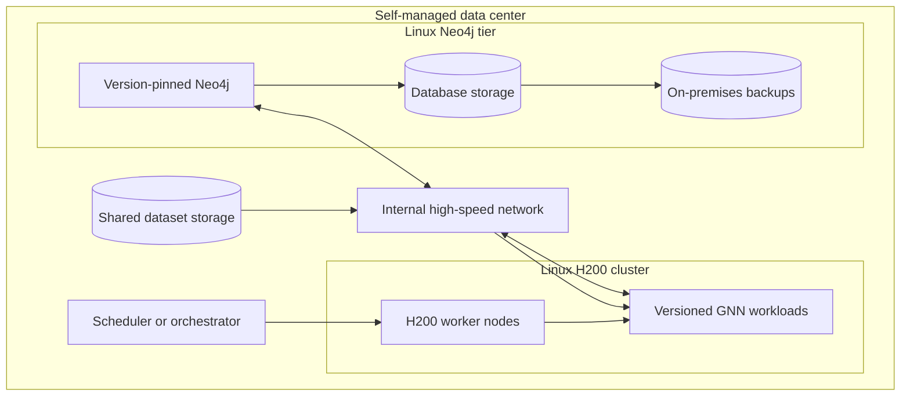

# Self-managed H200 cluster summary

## Current target

Production runs entirely in one self-managed data center. Linux H200 workers run
versioned PyTorch/PyG containers. Neo4j runs on a separate Linux database tier
and communicates with training workloads over the internal network.

## Portability contract

- Core models, tensors, preprocessing, and checkpoints remain device-neutral.
- `poc/run_linux_cuda.py` supplies the CUDA profile to the shared POC runner;
  execution still requires validation on the NVIDIA environment.
- `poc/run_wikics_linux_cuda.py` provides the equivalent larger-workload CUDA
  validation entry point.
- Kaggle POCs validate single-GPU CUDA portability before H200 access, but do
  not validate H200 performance, BF16 or FP8, NCCL, or multi-GPU behavior.
- Checkpoints load through CPU and then move to the selected device.
- BF16, FP8, NCCL, and CUDA/Triton kernels are optional H200 accelerators.
- Final CUDA and PyTorch versions follow the deployed driver compatibility
  matrix and are not pinned during design.

## Open decisions

- H200 node count, GPU topology, and interconnect.
- Linux distribution, driver, and container runtime.
- Slurm, Kubernetes, or another on-premises scheduler.
- Shared storage and local NVMe design.
- Neo4j edition, standalone or clustered topology, and sizing.
- Backup targets, recovery objectives, monitoring, and security controls.
