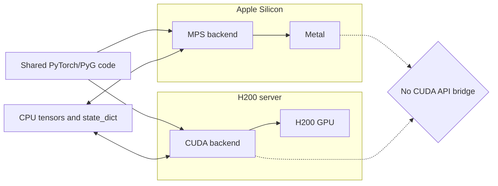
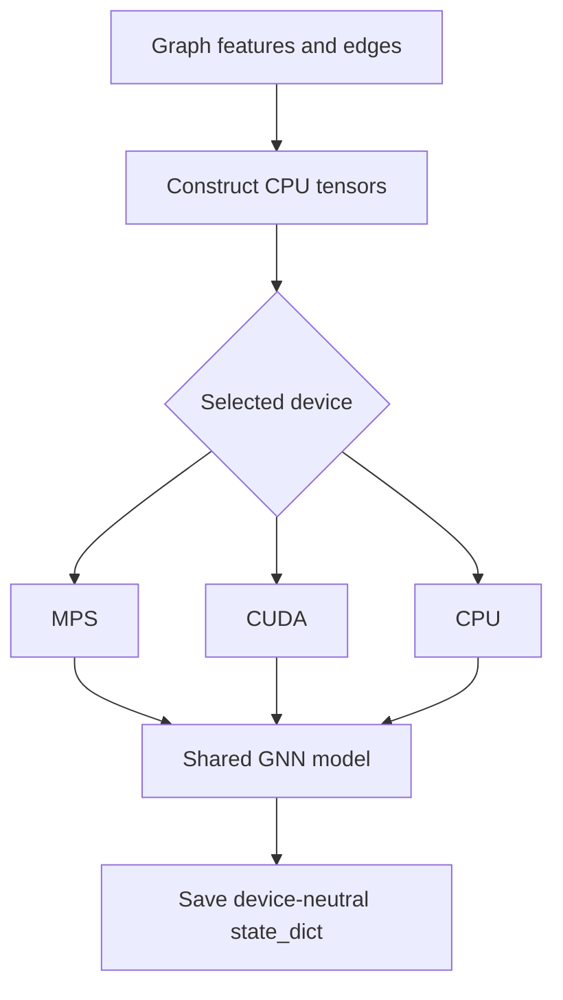

# ADR-001: Portable tensors and model code, not CUDA APIs

- Status: Proposed
- Date: 2026-09-04

## Context

Development happens on an Apple M2 Pro, while later training will use an NVIDIA
H200. The two GPUs use different software stacks: Metal/MPS on macOS and CUDA on
Linux.

## Decision

Treat PyTorch tensors, modules, PyTorch Geometric data objects, and
device-neutral checkpoints as the portability layer. Select the device at
runtime. Do not make direct CUDA APIs part of the core application interface.

## Direct answer

Metal does **not** support the CUDA API. Code that directly calls CUDA libraries,
CUDA kernels, NCCL, or CUDA-only extensions will not run through Metal.

Tensors are more portable, with limits:

- CPU tensors and normal PyTorch operations move cleanly with `.to(device)`.
- Model weights are portable when stored as a `state_dict` and loaded with a CPU
  map before transfer to the target device.
- Most common GNN layers are portable when their underlying operators exist on
  both MPS and CUDA.
- Some MPS operators may be missing or slower and need a CPU fallback.
- Custom CUDA/Triton kernels, CUDA graphs, NCCL, and some sparse extensions are
  server-specific.
- Floating-point results can differ slightly across CPU, MPS, and CUDA, so tests
  should use tolerances rather than bit-for-bit equality.

## Consequences

Core correctness can be developed locally. Final performance, mixed precision,
large-scale neighbor sampling, and all CUDA-specific behavior must be tested on
the H200. The architecture allows optional CUDA acceleration without creating a
second application codebase.
