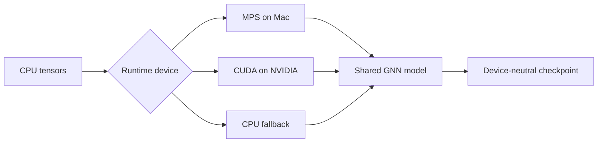

# ADR-001: Portable compute interface

- Status: Accepted for local development; CUDA validation pending
- Date: 2026-09-05

## Decision

Use PyTorch tensors, modules, PyTorch Geometric data objects, and device-neutral
`state_dict` checkpoints as the portability layer. Select CUDA, MPS, or CPU at
runtime. Direct CUDA APIs are outside the portable core.

## Compatibility summary

| Portable | Platform-specific |
| --- | --- |
| CPU tensors and normal PyTorch operations | Custom CUDA or Triton kernels |
| PyG models using supported operators | NCCL and CUDA graphs |
| `state_dict` checkpoints | H200-specific FP8 optimization |
| Tolerance-based correctness tests | Unsupported MPS sparse operations |

Metal does not implement the CUDA API. Final performance, distributed behavior,
mixed precision, and CUDA-specific paths require NVIDIA validation.

## Consequences

- One core codebase supports Mac development and H200 deployment.
- The verified one-layer GCN runs forward, backward, and optimization on MPS
  with CPU fallback disabled.
- Other MPS operator gaps may still require CPU fallback.
- Numerical tests use tolerances rather than bit-for-bit equality.
