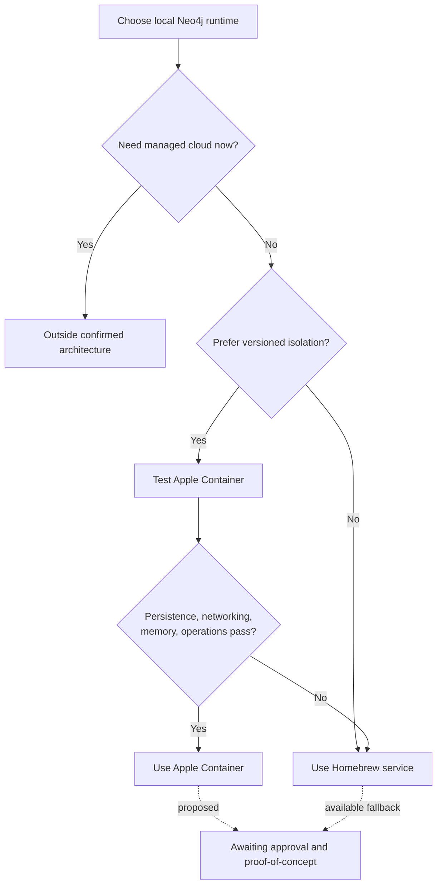

# ADR-002: Local Neo4j runtime

- Status: Proposed; proof-of-concept required
- Date: 2026-09-04

## Options

| Option | Strengths | Weaknesses |
| --- | --- | --- |
| Apple Container | OCI isolation, explicit Neo4j version, clean replacement, durable named volumes | Installed CLI is old, no assumed native Compose, young runtime, VM memory overhead |
| Homebrew service | Simplest local operation, no container layer, already installed | Host-level Java/database state, upgrades less isolated, lower parity with server containers |

## Proposed decision

Prefer Apple Container for local Neo4j if a small proof-of-concept confirms
reliable networking and volume persistence. Keep Python/PyTorch on the macOS host
for MPS access. Fall back to the dormant Homebrew installation if Apple
Container creates friction.

This decision does not recommend putting PyTorch training in Apple Container,
because the container runtime does not currently expose the Mac GPU.

## Acceptance criteria

- Official Neo4j ARM64 image starts without emulation.
- Browser on port 7474 and Bolt on 7687 are reachable only as intended.
- Database survives container deletion and recreation through a named volume.
- Authentication uses an untracked secret.
- Resource limits coexist comfortably with a 16 GB development laptop.
- Start, stop, backup, upgrade, and recovery steps are documented.

No option will be configured until implementation is approved.

This ADR governs only the Mac development runtime. Production Neo4j is a
version-pinned, self-managed Linux deployment in the same data center as the
H200 cluster, as recorded in ADR-003.
