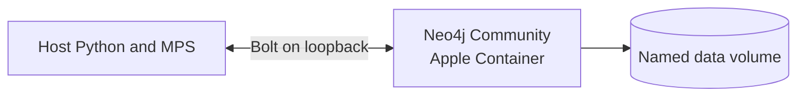

# ADR-002: Local Neo4j runtime

- Status: Accepted for the local proof-of-concept
- Date: 2026-09-05

## Decision

Use a version-pinned Neo4j Community ARM64 image in Apple Container for local
integration work. Keep Python and MPS training on the macOS host.

## Verified POC criteria

- Neo4j Community 2026.07.1 runs as native Linux ARM64.
- Only Bolt is host-published, on `127.0.0.1:7687`.
- Data survived deletion and recreation of the container definition.
- Authentication is stored in an ignored mode-0600 environment file.
- The container is limited to 2 CPUs and 2 GB memory.

## Consequences

Local Neo4j remains separate from host-native MPS compute. This ADR does not
govern production, which uses self-managed Linux Neo4j in the data center.
Backup and restore validation remains production-hardening work.
