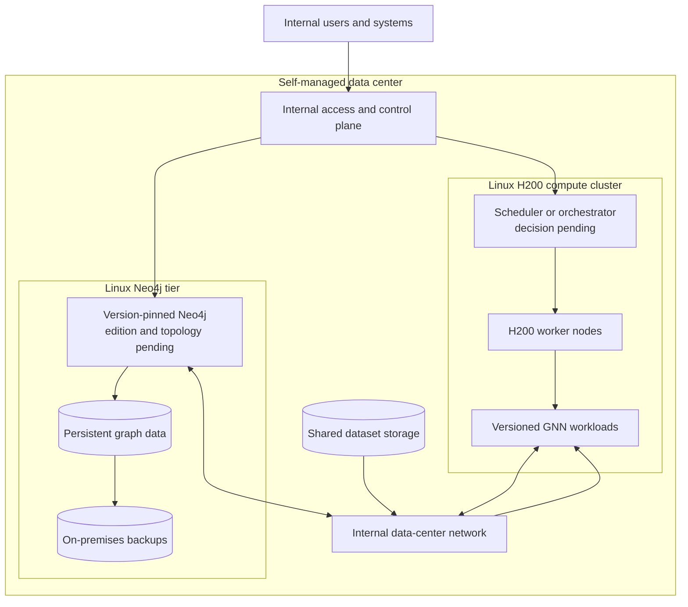

# ADR-003: Self-managed data-center production topology

- Status: Accepted direction; product-level choices remain open
- Date: 2026-09-04

## Context

The production system will include an NVIDIA H200 cluster, Neo4j, storage, and
supporting infrastructure. The user has specified that all components will run
inside the same self-managed data center and that the servers run Linux.

## Decision

Use an entirely self-managed, on-premises production platform:

- a Linux H200 compute cluster for GNN training and inference;
- a separate Linux CPU, memory, and storage tier for Neo4j;
- self-managed shared dataset and backup storage;
- an internal data-center network between compute, database, and storage;
- explicit immutable versions for Neo4j and training container images;
- no cloud-managed runtime dependency in the target architecture.

## Consequences

- The organization owns provisioning, patching, monitoring, security,
  availability, backup, recovery, and capacity planning.
- The system avoids dependency on AuraDB or cloud GPU services.
- Neo4j and GPU workloads can scale independently while remaining on a low-latency
  internal network.
- A separate failure domain and backup plan are still required even though all
  infrastructure is in one data center.
- Scheduler, Linux distribution, network fabric, storage, Neo4j edition, and
  Neo4j clustering are follow-up decisions, not implied by this ADR.

