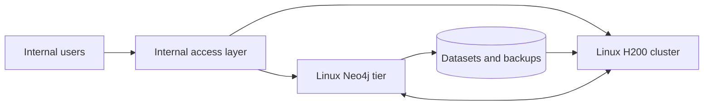

# ADR-003: Self-managed production topology

- Status: Accepted direction; product-level choices remain open
- Date: 2026-09-04

## Decision

Run the complete production platform in one self-managed data center:

- Linux H200 compute cluster for GNN workloads.
- Separate Linux Neo4j database tier.
- On-premises dataset, database, and backup storage.
- Internal data-center networking.
- Explicit immutable versions for Neo4j and workload images.
- No cloud-managed runtime dependency.

## Consequences

- The organization owns provisioning, patching, monitoring, security,
  availability, backup, recovery, and capacity planning.
- Compute and database resources scale independently.
- The design still requires separate failure domains and recovery procedures
  inside the data center.

Open choices: scheduler, Linux distribution, network fabric, storage platform,
Neo4j edition, and Neo4j clustering topology.
