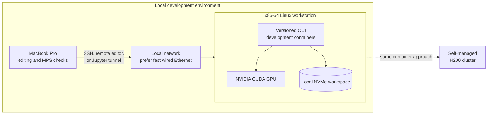

# ADR-004: Local NVIDIA development device

- Status: Proposed
- Date: 2026-09-04

## Context

The primary laptop is an Apple Silicon MacBook Pro. Local work can use PyTorch
MPS, while production will use a self-managed Linux H200 cluster. Some CUDA-only
code should be developed and tested locally before it reaches the data center.

The GPU must be purchased new. The user does not want the reliability and
unknown-history risk of a used device, and the workstation is for compute rather
than gaming. Procurement therefore requires an official Indonesian warranty and
excludes used, refurbished, and import-only units.

Apple Silicon Macs cannot use an external GPU, and Metal does not implement the
CUDA API. Apple Container also does not currently expose the Mac GPU to Linux
containers. The NVIDIA device therefore needs to be a separate computer.

## Proposed decision

Use a dedicated x86-64 Linux workstation on the local network. Keep the Mac as
the interactive development device and connect to the workstation through SSH,
remote editor tooling, or Jupyter over an SSH tunnel.

## Recommended new-only tiers

| Tier | Device | Best when | Important limitation |
| --- | --- | --- | --- |
| Preferred near half-price | Linux tower with RTX PRO 4000 Blackwell | GNN development values 24 GB VRAM, ECC, low power, and professional lifecycle support | Slower raw compute than RTX 5080; verify the exact full-height 24 GB model |
| Lower-cost performance option | Linux tower with GeForce RTX 5080 | Workloads fit 16 GB and raw CUDA throughput per rupiah matters most | 16 GB can constrain graph batches; no ECC and consumer support model |
| Higher-performance reference | Linux tower with GeForce RTX 5090 | 32 GB and substantially greater local throughput justify the price | Current Jakarta pricing is far above the half-price target; 575 W GPU power |
| Large-memory professional | Linux workstation with RTX PRO 6000 Blackwell Workstation Edition | Local working sets exceed 32 GB or ECC and professional support matter | 96 GB VRAM and ECC, but 600 W and substantially higher acquisition cost |
| Compact alternative | NVIDIA DGX Spark | Quiet compact system and large unified address space matter more than peak graph throughput | ARM CPU and 273 GB/s unified-memory bandwidth reduce parity with an x86 H200 workflow |
| Portable exception | NVIDIA laptop | Work must travel and reduced performance is acceptable | Lower sustained power, cooling, VRAM, and upgradeability |

## Current recommendation

Prefer a new RTX PRO 4000 Blackwell 24 GB for this non-gaming development
workstation if a full-height card with official local warranty is available near
Rp44-50 million. Its 24 GB GDDR7 with ECC gives 50% more device memory than an
RTX 5080, while its 145 W board power simplifies cooling, power delivery, and
quiet continuous compute. This is the better-balanced local GNN tool when the
H200 cluster remains the destination for full-scale performance.

Choose a new RTX 5080 instead when measured workloads fit comfortably inside
16 GB and training speed per rupiah has higher priority than memory capacity,
ECC, and professional support. July 2026 Jakarta listings observed during design
were roughly Rp24-30 million, depending on the board and seller. A GeForce label
does not prevent CUDA or Tensor Core compute, but its gaming features are not a
reason to buy it for this workload.

Do not buy either card solely from an online listing. Before purchase, obtain a
written quotation identifying the exact part number, sealed-new condition,
authorized Indonesian distributor, warranty duration and service path, stock
status, invoice tax treatment, and return/dead-on-arrival policy.

## Why the RTX 5090 is now a reference tier

The RTX 5090 provides current-generation CUDA and 32 GB GDDR7 in a standard
Linux workstation. This is enough for development, correctness tests, smaller
full-batch graphs, and many sampled mini-batch GNN workloads. It does not imitate
an H200's capacity: an H200 has 141 GB HBM3e and far greater memory bandwidth.
Final scale, distributed behavior, and H200-specific optimization still require
the data-center cluster.

The workstation should prioritize system RAM and storage as well as the GPU. A
sensible design target is at least 128 GB system memory, fast NVMe storage, ample
case airflow, and a high-quality power supply sized for the complete system.
Exact components and power margin should be selected after the workload and
local electrical/noise constraints are known.

## When to choose RTX PRO 6000 instead

Choose the 96 GB RTX PRO 6000 when profiling shows that 32 GB forces unacceptable
sampling, partitioning, or CPU offload, or when ECC and professional lifecycle
support are requirements. Do not buy it merely to make the workstation resemble
the H200: it is still a different GPU architecture and memory system.

## Why DGX Spark is not the default

DGX Spark offers 128 GB coherent unified memory in a compact 240 W system, which
is attractive for memory-capacity experiments. Its memory bandwidth is 273 GB/s,
far below both high-end discrete workstation GPUs and H200 HBM. It also uses an
ARM CPU. Those differences can matter for Python native extensions, containers,
data preprocessing, sparse operators, and GNN throughput. It is a useful
specialized option, not the closest local rehearsal environment for the planned
x86-64 Linux cluster.

## Procurement questions and acceptance checks

- Maximum local graph, feature, optimizer-state, and batch memory requirement.
- Whether neighbor sampling is acceptable or full-batch execution is required.
- Final GPU and complete-workstation budget.
- Factory-sealed new stock with an official Indonesian distributor warranty;
  reject used, refurbished, ex-display, repaired, mining, and import-only units.
- Exact part number, memory capacity, card dimensions, power connector, and PSU
  recommendation confirmed on the manufacturer's product page.
- Available circuit capacity, heat, and noise tolerance.
- Required local network bandwidth to the Mac and storage.
- Need for one GPU now versus future multi-GPU expansion.
- Whether the workstation must also host a disposable Neo4j test instance.

## Sources

- [Apple eGPU requirements](https://support.apple.com/en-gb/102363)
- [NVIDIA RTX PRO 4000 Blackwell data sheet](https://www.nvidia.com/content/dam/en-zz/Solutions/products/workstations/professional-desktop-gpus/rtx-pro-4000/workstation-datasheet-rtx-pro-4000-nvidia-us-web.pdf)
- [Observed Indonesian RTX PRO 4000 price list](https://rakitan.com/contact/pricelist.php)
- [Observed Jakarta RTX PRO 4000 listing](https://www.blibli.com/p/leadtek-nvidia-rtx-pro-4000-blackwell-sff-edition/ps--FHS-18424-02484)
- [NVIDIA GeForce RTX 5080 specifications](https://www.nvidia.com/en-us/geforce/graphics-cards/50-series/rtx-5080/)
- [Observed Jakarta RTX 5080 listing](https://www.blibli.com/p/vga-card-gigabyte-geforce-rtx-5080-windforce-oc-sff-16g-16gb-gddr7/ps--GIE-70091-00399)
- [NVIDIA GeForce RTX 5090 specifications](https://www.nvidia.com/en-us/geforce/graphics-cards/50-series/rtx-5090/)
- [NVIDIA RTX PRO 6000 Blackwell specifications](https://www.nvidia.com/en-us/products/workstations/professional-desktop-gpus/rtx-pro-6000/)
- [NVIDIA DGX Spark specifications](https://www.nvidia.com/en-us/products/workstations/dgx-spark/)
- [NVIDIA H200 system comparison](https://docs.nvidia.com/enterprise-reference-architectures/whitepaper/hgx-servers-and-spectrum-x.pdf)
