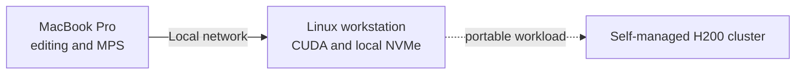

# ADR-004: Local NVIDIA development device

- Status: Proposed
- Date: 2026-09-04

## Decision

Use a separate x86-64 Linux workstation on the local network for CUDA
development. Keep the Mac as the interactive development device and connect by
SSH, remote editor, or Jupyter through an SSH tunnel.

## Procurement constraints

- Factory-new, sealed hardware only.
- Official Indonesian distributor warranty and clear service path.
- Exclude used, refurbished, ex-display, repaired, mining, and import-only units.
- Verify the part number, VRAM, dimensions, connector, and PSU specification.

## Current shortlist

| Priority | GPU | Fit | Limitation |
| --- | --- | --- | --- |
| Preferred | RTX PRO 4000 Blackwell | 24 GB ECC, 145 W, professional lifecycle | Lower raw throughput than RTX 5080 |
| Lower-cost speed | GeForce RTX 5080 | Strong CUDA performance per rupiah | 16 GB, no ECC, consumer support |
| Higher-performance reference | GeForce RTX 5090 | 32 GB and greater throughput | High price, power, heat, and noise |

Observed Jakarta pricing on 2026-09-04 was approximately Rp44-50 million for
RTX PRO 4000 Blackwell and Rp24-30 million for RTX 5080 listings. A written quote
must confirm stock, warranty, taxes, and return terms.

## Current recommendation

Prefer RTX PRO 4000 Blackwell 24 GB for the non-gaming GNN workstation when the
budget permits. Its additional VRAM, ECC, low power, and professional support are
more useful than gaming features. Choose RTX 5080 when measured workloads fit in
16 GB and throughput per rupiah is the priority.

Target at least 128 GB system memory, fast NVMe storage, adequate airflow, and a
quality PSU. Final scale and H200 optimization remain data-center responsibilities.

Sources: [RTX PRO 4000](https://www.nvidia.com/content/dam/en-zz/Solutions/products/workstations/professional-desktop-gpus/rtx-pro-4000/workstation-datasheet-rtx-pro-4000-nvidia-us-web.pdf),
[RTX 5080](https://www.nvidia.com/en-us/geforce/graphics-cards/50-series/rtx-5080/),
[RTX 5090](https://www.nvidia.com/en-us/geforce/graphics-cards/50-series/rtx-5090/), and
[H200](https://www.nvidia.com/en-us/data-center/h200/).
