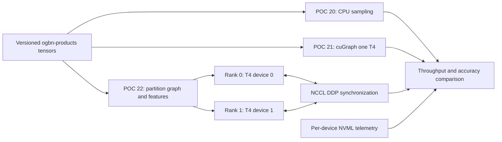

# Proposed cuGraph-PyG T4x2 proof

- Status: Proposed; design only as of 2026-09-12
- Planned scope: POCs 20 through 22 on private Kaggle jobs
- Accelerator: Kaggle T4x2 machine shape; never P100
- Database: none

## Objective

Demonstrate whether GPU-resident cuGraph-PyG storage and neighbor sampling
improves end-to-end sampled GNN training, and separately whether it scales from
one T4 to both T4s. The proof must measure useful work and concurrent device
participation; merely detecting two CUDA devices is insufficient.

"Use both T4s fully" means both devices perform balanced work through most of
the measured region. It does not mean combining their memory into one 32 GB
pool or requiring a misleading 100% utilization reading.

As observed on 2026-09-12, T4x2 is Kaggle's largest standard free T4 machine
shape: two separate approximately 16 GB devices, four CPU cores, and 29 GB host
memory. Availability and account quota remain variable and must be checked
immediately before execution.

## Workload

Use the free, openly available `ogbn-products` node-classification dataset. Its
loaded graph has 2,449,029 nodes, 61,859,140 edge entries, 100 input features,
and 47 classes. This is substantially larger than Flickr and is the default
dataset in NVIDIA's multi-GPU cuGraph-PyG GCN example.

Freeze one workload before execution:

| Setting | Proposed value |
| --- | --- |
| Model | Three-layer PyG GraphSAGE |
| Hidden width | 256 |
| Precision | FP32 |
| Fanout | 15, 10, 5 |
| Global seed batch | 4,096 |
| T4x2 seed batch | 2,048 per rank |
| Measured work | 20 complete training epochs |
| Optimizer and seed | Identical across all variants |
| Split and metric | Official OGB split and accuracy |

Twenty epochs yield about 960 global optimizer steps and repeatedly exercise
the sampler. Dataset download, conversion, dependency installation, process-
group initialization, and one warm-up epoch stay outside the steady-state
timer. Setup time remains a separately reported end-to-end cost.

## Comparison matrix

| POC | Loader and storage | GPUs | Purpose |
| --- | --- | ---: | --- |
| 20 | Plain PyG CPU `NeighborLoader` | 2 | Same-hardware baseline |
| 21 | cuGraph-PyG and WholeGraph | 1 visible | Single-device reference |
| 22 | cuGraph-PyG and WholeGraph | 2 | Target proof |

POC 20 versus POC 22 isolates the graph-backend benefit while keeping two T4s.
POC 21 versus POC 22 measures cuGraph scale-out. All three jobs use the same
source revision, Kaggle image, T4x2 machine shape, model, global batch, number
of seeds, optimizer steps, and evaluation path. POC 21 intentionally hides the
second T4; POCs 20 and 22 must use it.

## Distributed execution design

Launch POCs 20 and 22 with `torchrun --nproc-per-node=2`. Each rank selects one
local T4, owns a disjoint shard of training seeds, and performs the same number
of optimizer steps. Gradients synchronize through NCCL DDP.

For POC 22, partition edges and features before constructing cuGraph-PyG
`GraphStore` and `FeatureStore` instances. Initialize pylibcugraph
communications and WholeGraph on both ranks, then use a distributed
cuGraph-PyG `NeighborLoader`. Do not replicate a complete GPU graph on each
device. Choose and record `local_seeds_per_call` explicitly.

POC 20 uses CPU-side PyG neighbor sampling with the same disjoint seed shards
and sends the resulting mini-batches to the same two-rank DDP model. Allocate
the four Kaggle CPU cores explicitly between ranks and loader workers so the
baseline is reproducible.

## Measurements

The primary metric is steady-state end-to-end training throughput in global
seed nodes per second. Its timer includes neighbor sampling, host-to-device
transfer where applicable, forward pass, backward pass, and the DDP optimizer
step. It excludes only setup and warm-up.

Also record:

- sampled edges per second and p50, p95, and p99 step latency;
- separate setup, warm-up, training, and evaluation durations;
- per-rank seeds, batches, sampled nodes, and sampled edges;
- per-GPU utilization, memory use, power, and temperature every 200 ms;
- PyTorch peak allocated and reserved memory on each device;
- CPU model, peak RSS, average process CPU, package versions, CUDA identity,
  NCCL identity, and Kaggle kernel version;
- loss trajectory, validation accuracy, and test accuracy.

GPU utilization is sampled only during the steady-state region. Report both
devices separately; never add percentages or present their memory as one pool.

## Acceptance gates

The target proof passes only when all correctness and execution gates pass:

1. Exactly two Tesla T4 devices with compute capability 7.5 are visible to
   POCs 20 and 22; two ranks bind to distinct device UUIDs.
2. Both ranks process 45% to 55% of global seeds, complete every planned step,
   and finish with identical model-state checksums after synchronization.
3. In POC 22, each rank owns non-empty edge and feature partitions and reports
   the cuGraph-PyG stores, distributed loader, WholeGraph, and NCCL identities.
4. During at least 80% of steady-state samples, both T4s simultaneously report
   non-zero compute utilization. Each device must have at least 50% median and
   80% p95 utilization, with no more than a 15-point median imbalance.
5. All losses and predictions are finite. POCs 20 and 22 must finish within two
   percentage points of each other in test accuracy. Exact predictions are not
   required because the two samplers need not choose identical neighbors.
6. POC 22 must exceed POC 20 steady-state seed throughput by at least 1.25x.
   POC 22 must exceed POC 21 by at least 1.40x, corresponding to at least 70%
   two-GPU scaling efficiency.

Failure to reach the speed gates is still a valid measurement, but it must be
reported as `NO_BENEFIT` rather than changed after seeing the result. This
prevents a convenient configuration from being selected retrospectively.

## One predeclared escalation

If the initial run passes correctness but spends less than 30% of measured time
sampling or fails the simultaneous-utilization gate, run one larger sampling
profile: fanout 25, 15, 10 with global batch 2,048 and otherwise identical
work. Record both profiles and keep the original as the primary result. Do not
add further workload changes without a new design decision.

## Known compatibility gate

A closed RAPIDS issue reported that its distributed GCN example failed while
sampling `ogbn-products` on multiple H100s. The public issue does not show a
resolution, and this repository has only verified cuGraph-PyG 26.2.1 on one T4.
Before consuming a complete benchmark run, execute one two-rank batch through
the exact pinned T4x2 environment and validate its seed offsets, batch IDs, and
rank outputs. A failure blocks POCs 20 through 22 for diagnosis; do not mix
RAPIDS release families or patch around it without updating this design.

## Artifacts and validation

Each job will emit a schema-versioned JSON result, per-rank records, 200 ms GPU
telemetry, and detached SHA-256 files under `/kaggle/working`. Raw downloads
remain ignored under `.artifacts/`; only a compact consolidated comparison will
be committed under `results/` after checksum, schema, source-revision, device,
workload-parity, live private-kernel `COMPLETE`, and acceptance-gate validation.

No prediction artifact from these performance-only POCs enters Neo4j. Kaggle
credentials, kernel owner identifiers, and private artifact locations remain
untracked.

## Planned implementation phases

1. Freeze one RAPIDS release family and pass the two-rank, one-batch
   compatibility gate without starting a benchmark.
2. Build one checksummed, versioned `ogbn-products` tensor input and partition
   manifest shared by all variants.
3. Add unit tests for seed partitioning, metric aggregation, telemetry gates,
   checksums, and comparison semantics.
4. Run POC 20, then POC 21, then POC 22 as immutable private Kaggle versions.
5. Apply the predeclared larger profile only if its trigger is met.
6. Download, validate, compare, document, commit, and push the proof.

Implementation and Kaggle execution require a separate explicit approval.

## Sources

- [Open Graph Benchmark node property prediction datasets](https://ogb.stanford.edu/docs/nodeprop/)
- [NVIDIA cuGraph-PyG API](https://docs.nvidia.com/cugraph/latest/api_docs/cugraph-pyg/cugraph_pyg/)
- [NVIDIA cuGraph-PyG GraphStore](https://docs.nvidia.com/cugraph/26.08/api_docs/api/cugraph-pyg/cugraph_pyg.data.graph_store.GraphStore/)
- [NVIDIA WholeGraph introduction](https://docs.nvidia.com/cugraph/26.08/wholegraph/basics/wholegraph_intro/)
- [RAPIDS multi-GPU cuGraph-PyG example](https://github.com/rapidsai/cugraph-gnn/blob/main/python/cugraph-pyg/cugraph_pyg/examples/gcn_dist_mnmg.py)
- [RAPIDS distributed sampling issue 412](https://github.com/rapidsai/cugraph-gnn/issues/412)
- [Kaggle notebook accelerator documentation](https://www.kaggle.com/docs/notebooks)
- [Kaggle efficient GPU usage and quota](https://www.kaggle.com/docs/efficient-gpu-usage)
