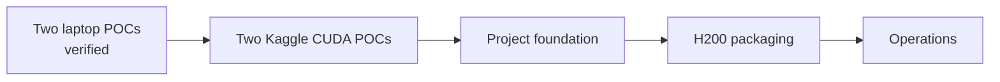

# Implementation phases

Both local proofs are complete. Two Kaggle CUDA proofs are implemented and await
their first remote executions. Data-center implementation remains pending.

## Verified local proof

- Host-native Python 3.14.7 environment with pinned direct dependencies.
- Karate Club graph round trip through Neo4j Community 2026.07.1.
- One shared parameterized GCN runner with ready MPS, CPU, and CUDA profiles.
- Forward, backward, and optimization verified on MPS and CPU.
- Idempotent rerun and named-volume persistence checks.
- Automated unit coverage for graph payload, environment, device, and connection
  behavior.
- Pinned WikiCS graph with 11,701 nodes, two-layer GCN, official splits, early
  stopping, and batched Neo4j round-trip persistence.

## Next: project foundation

- Run both private Kaggle CUDA kernels and import their validated artifacts.

- Decide the long-term Python and dependency-locking policy.
- Extract reusable schema, query, and tensor adapters from the POC.
- Add experiment reproducibility controls as workloads grow.

## H200 packaging

- Select compatible Linux, driver, CUDA, and PyTorch versions.
- Build versioned workload containers and cluster validation.
- Benchmark precision, communication, sampling, loading, and memory.

## Operational hardening

- Add dataset and experiment reproducibility.
- Validate Neo4j backup, restore, and schema migration.
- Define monitoring, security, failure handling, and recovery objectives.
