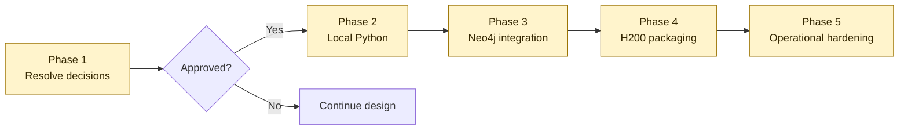

# Future implementation phases

All phases are pending explicit approval.

## Phase 1: Resolve architecture decisions

- Confirm PyTorch Geometric as the primary GNN framework.
- Accept or revise ADR-001.
- Test Apple Container and accept or revise ADR-002.
- Refine ADR-003 with data-center scheduler, storage, network, and Neo4j topology
  decisions.
- Measure local CUDA memory requirements and accept or revise ADR-004 before
  purchasing a workstation.
- Procure only factory-new local NVIDIA hardware with an official Indonesian
  warranty after the exact model, seller, and return terms are verified.

## Phase 2: Local Python foundation

- Pin an isolated Python version with `uv`.
- Add PyTorch, PyTorch Geometric, Neo4j driver, tests, linting, and notebooks.
- Implement CUDA/MPS/CPU device selection.
- Verify a small in-memory GNN on MPS and CPU.

## Phase 3: Neo4j integration

- Provision the accepted local database runtime.
- Create secret handling and persistent storage.
- Define the initial property-graph schema and constraints.
- Build a Neo4j-to-PyG adapter and an end-to-end smoke test.

## Phase 4: Self-managed H200 cluster packaging

- Inspect every H200 node, driver, accelerator, and network topology.
- Select a compatible official PyTorch CUDA image.
- Add a versioned H200 container definition and cluster validation suite.
- Integrate with the selected on-premises scheduler or orchestrator.
- Benchmark BF16, FP8 where appropriate, distributed communication, sampling,
  data loading, and memory.

## Phase 5: Operational hardening

- Reproducible dataset snapshots and experiment tracking.
- Neo4j backup/restore and schema migrations.
- Model checkpoint, evaluation, and deployment procedures.
- Monitoring for GPU utilization, input pipeline, and database query latency.
- Data-center capacity, failure-domain, security, and recovery procedures.
