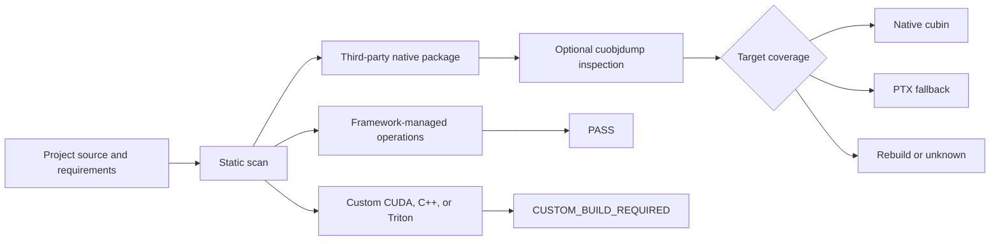

# CUDA portability validator

## Current status

The repository includes a standard-library validator that detects project-owned
CUDA/C++ extensions, custom runtime GPU kernels, framework-managed runtime JIT,
and known third-party CUDA extension packages. It targets the planned H200
production architecture (`sm_90`) and RTX 50-series workstation architecture
(`sm_120`) by default.



Run the repository validation and write ignored JSON and Markdown evidence:

```bash
bun run cuda:validate
```

Inspect explicitly listed native packages when the CUDA toolkit and
`cuobjdump` are available:

```bash
python3 ./poc/cuda_portability_validator.py \
  --root . \
  --target sm_90 \
  --target sm_120 \
  --package torch-sparse \
  --inspect-binaries
```

## Result meanings

| Result | Meaning |
| --- | --- |
| `PASS` | No project custom compilation requirement was detected. |
| `PASS_WITH_PTX` | Native dependency coverage uses forward-compatible PTX. |
| `CUSTOM_BUILD_REQUIRED` | Project CUDA/C++ or Triton code requires target-aware compilation or testing. |
| `REBUILD_REQUIRED` | An inspected native dependency lacks a required target and PTX fallback. |
| `UNKNOWN` | A native or dynamic code path could not be verified. |

Passing states exit with code 0. Build or rebuild requirements exit with code
2, and unknown coverage exits with code 3 so the command can act as a CI gate.

The validator establishes build requirements; it cannot replace final runtime
and performance validation on H200.
