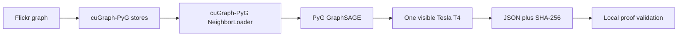

# cuGraph-PyG Kaggle proof

- Status: Verified PASS on 2026-09-11
- POC 17: sampled Flickr GraphSAGE on one visible Kaggle Tesla T4
- Scope: CUDA integration only; no Neo4j and no CPU/MPS comparison
- Kaggle proof: private kernel version 3

This proof trains a standard PyG `SAGEConv` model from batches produced by
cuGraph-PyG's `GraphStore`, `FeatureStore`, and `NeighborLoader`. It initializes
a one-worker NCCL process group and the pylibcugraph communicator, and fails if
the visible CUDA device is not a T4 with compute capability 7.5.



## Verified result

| Check | Evidence |
| --- | ---: |
| Dataset | 89,250 nodes and 899,756 edges |
| Model | Three-layer GraphSAGE, 391,175 parameters |
| Sampling | Fanout 15, 10, 5; batch size 1,024 |
| Work processed | 440 batches and 86,154,606 sampled edges |
| Training time | 36.320 seconds |
| Sampling time | 10.425 seconds |
| Validation accuracy | 42.390% |
| Test accuracy | 42.357% |
| Peak CUDA allocation | 2,489,652,224 bytes, 2.32 GiB |
| Peak CUDA reservation | 3,477,078,016 bytes, 3.24 GiB |

The 36.320-second measurement covers sampled training and full-graph validation
for this POC. It is not a speed comparison with the earlier full-batch Flickr
workloads because the execution strategies differ.

The checksum-valid artifact records Python 3.12.13, PyTorch 2.10.0 with CUDA
12.8, PyG 2.7.0, cuGraph-PyG 26.2.1, pylibcugraph 26.2.0, and
pylibwholegraph 26.2.1. The committed compact record is
[`results/kaggle-flickr-cugraph-pyg-t4.json`](../../results/kaggle-flickr-cugraph-pyg-t4.json).

## Environment constraint

Kaggle's observed image contains RAPIDS 26.2 components. This POC therefore
uses cuGraph-PyG 26.2.1 and its supported PyG 2.7.0 range. All cuGraph runtime
packages must remain in the same RAPIDS release family. The allocated Kaggle
machine exposed multiple CUDA devices, but the wrapper exposes only device zero
to this intentionally single-GPU proof.

This run validates T4 `sm_75` execution only. H200 `sm_90`, WholeGraph,
multi-GPU sampling, and NCCL scaling remain future data-center validation work.

## Reproduction

```bash
kaggle kernels push -p kaggle/cugraph-pyg-cuda
kaggle kernels output andird/ml-poc-17-flickr-cugraph-pyg-t4 \
  -p .artifacts/cugraph-pyg-v3 --force
bun run poc:kaggle:cugraph-pyg:validate -- \
  .artifacts/cugraph-pyg-v3/cugraph-pyg-flickr-result.json \
  --verify-kaggle-status --force
```

## Sources

- [NVIDIA cuGraph-PyG API](https://docs.nvidia.com/cugraph/latest/api_docs/cugraph-pyg/cugraph_pyg/)
- [NVIDIA cuGraph package installation](https://docs.nvidia.com/cugraph/26.10/installation/getting_cugraph/)
