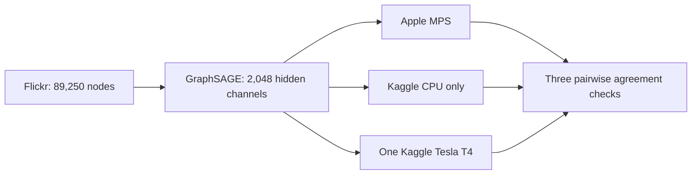

# Flickr 2,048-channel benchmark

- Status: Ready for execution
- POC 11: Flickr GraphSAGE on Kaggle CPU only
- POC 12: the identical workload on one Kaggle Tesla T4
- Third environment: host-native Apple MPS with CPU fallback disabled
- Scope: comparison only; no Neo4j import

This workload retains the complete open Flickr graph and increases each hidden
GraphSAGE layer to 2,048 channels. All three environments use FP32, the same
model, data split, seed, optimizer, requested 20 epochs, and early-stopping
patience of six.

To fit the laptop's 16 GB unified memory without reducing the requested width,
all environments use exact mean aggregation in fixed 262,144-edge chunks. This
changes only the temporary workspace: every edge and node remains in the graph,
and the layer formula and trainable parameters remain GraphSAGE-equivalent. A
pure-PyTorch autograd rule recomputes the same bounded chunks during backward
instead of retaining every gathered edge message. It is not a CUDA extension.

## Acceptance checks

- Every artifact passes schema and detached SHA-256 validation.
- Model and dataset metadata match exactly across MPS, CPU, and CUDA.
- The model records the same exact chunked-aggregation strategy everywhere.
- All three predicted-class pairs agree on at least 95% of nodes.
- The CPU runner proves CUDA unavailable and records Linux `wait4` resource use.
- The CUDA runner proves single-T4 execution and at least 8 GiB peak allocation.
- The MPS runner proves MPS availability with CPU fallback disabled.
- Each Kaggle wrapper is pinned to the executable source revision it runs.

The final comparison will be recorded under `results/` only after all checks
pass. These prediction artifacts are not eligible for Neo4j import.
