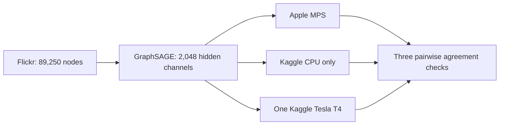

# Flickr 2,048-channel benchmark

- Status: Verified PASS on 2026-09-05
- POC 11: Flickr GraphSAGE on Kaggle CPU only
- POC 12: the identical workload on one Kaggle Tesla T4
- Third environment: host-native Apple MPS with CPU fallback disabled
- Scope: comparison only; no Neo4j import

This workload retains the complete open Flickr graph and increases each hidden
GraphSAGE layer to 2,048 channels. All three environments use FP32, the same
model, data split, seed, optimizer, requested 20 epochs, and early-stopping
patience of six.

To fit the laptop's 16 GB unified memory without reducing the requested width,
all environments use exact mean aggregation in fixed 262,144-edge chunks. This
changes only the temporary workspace: every edge and node remains in the graph,
and the layer formula and trainable parameters remain GraphSAGE-equivalent. A
pure-PyTorch autograd rule recomputes the same bounded chunks during backward
instead of retaining every gathered edge message. It is not a CUDA extension.



## Acceptance checks

- Every artifact passes schema and detached SHA-256 validation.
- Model and dataset metadata match exactly across MPS, CPU, and CUDA.
- The model records the same exact chunked-aggregation strategy everywhere.
- All three predicted-class pairs agree on at least 95% of nodes.
- The CPU runner proves CUDA unavailable and records Linux `wait4` resource use.
- The CUDA runner proves single-T4 execution and at least 8 GiB peak allocation.
- The MPS runner proves MPS availability with CPU fallback disabled.
- Each Kaggle wrapper is pinned to the executable source revision it runs.

## Verified evidence

| Check | Apple M2 Pro MPS | Kaggle CPU | Kaggle Tesla T4 |
| --- | ---: | ---: | ---: |
| Kernel | Host native | POC 11 v3 | POC 12 v3 |
| Processor | Apple M2 Pro | AMD EPYC 7B12, 4 cores | Tesla T4, capability 7.5 |
| Training time | 576.983s | 1,521.329s | 56.579s |
| Test accuracy | 42.3341% | 42.3475% | 42.3341% |
| Best epoch | 20 | 19 | 17 |
| Model parameters | 10,469,383 | 10,469,383 | 10,469,383 |
| Peak measured memory | Process RSS excludes Metal | 12.13 GB RSS | 10.35 GB allocated; 13.90 GB reserved |

The T4 training region was 26.888 times faster than Kaggle CPU and 10.198 times
faster than MPS. MPS was 2.637 times faster than Kaggle CPU. Class agreement was
99.9238% for MPS versus CPU, 99.9272% for MPS versus T4, and 99.8723% for CPU
versus T4.

The T4 exposed 15.64 GB total device memory. Peak allocation was 66.19% and
peak reservation was 88.87%. The complete CPU runner took 1,614.60 seconds wall
time, used 12.13 GB maximum RSS, and averaged 179.083% process CPU. CPU RSS,
CUDA allocator memory, and macOS process RSS describe different memory domains.

Both Kaggle artifacts ran source revision
`3836213605a257f70371de55036bd91ce99480a4`. All artifacts are comparison-only
and are not eligible for Neo4j import.

## Reproduction

```bash
kaggle kernels push -p kaggle/flickr-2048-cpu
kaggle kernels push -p kaggle/flickr-2048-cuda
bun run poc:mps:flickr:2048 -- --force

bun run poc:compare:three -- \
  .artifacts/flickr-2048-mps/flickr-2048-mps-result.json \
  .artifacts/flickr-2048-cpu/flickr-2048-cpu-result.json \
  .artifacts/flickr-2048-cuda/flickr-2048-cuda-result.json \
  --cpu-resource-usage \
  .artifacts/flickr-2048-cpu/flickr-2048-cpu-resource-usage.json \
  --minimum-agreement 0.95 \
  --verify-kaggle-status
```
