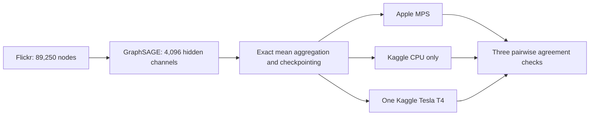

# Flickr 4,096-channel benchmark

- Status: Verified PASS on 2026-09-06
- POC 13: Flickr GraphSAGE on Kaggle CPU only
- POC 14: the identical workload on one Kaggle Tesla T4
- Third environment: host-native Apple MPS with CPU fallback disabled
- Scope: comparison only; no Neo4j import

This workload retains the full open Flickr graph and increases each hidden
GraphSAGE layer to 4,096 channels. MPS, CPU, and CUDA use FP32, the same data
split, seed, optimizer, 20 requested epochs, and early-stopping patience six.



All environments use exact mean aggregation and pure-PyTorch activation
checkpointing. CPU and T4 use 131,072-edge workspaces; MPS uses 32,768 edges to
fit shared memory. Chunk size controls only temporary execution storage, so the
graph, width, layer formula, and trainable parameters are unchanged. Forward
blocks are recomputed during backward. No compiled CUDA extension is introduced.

## Acceptance checks

- Every artifact passes schema and detached SHA-256 validation.
- Model and dataset metadata match exactly across MPS, CPU, and CUDA.
- Each artifact records its backend-appropriate execution workspace separately.
- All three predicted-class pairs agree on at least 95% of nodes.
- The CPU runner proves CUDA unavailable and records Linux `wait4` resource use.
- The CUDA runner proves one-T4 execution and at least 10 GiB peak allocation.
- The MPS runner proves MPS availability with CPU fallback disabled.
- Each Kaggle wrapper is pinned to the executable source revision it runs.

## Verified evidence

| Check | Apple M2 Pro MPS | Kaggle CPU | Kaggle Tesla T4 |
| --- | ---: | ---: | ---: |
| Kernel | Host native | POC 13 v3 | POC 14 v3 |
| Processor | Apple M2 Pro | Intel Xeon 2.20 GHz, 4 cores | Tesla T4, capability 7.5 |
| Edge workspace | 32,768 | 131,072 | 131,072 |
| Training time | 448.473s | 6,828.020s | 177.868s |
| Epochs completed; best epoch | 20; 14 | 20; 16 | 17; 11 |
| Test accuracy | 42.3968% | 42.3251% | 42.4327% |
| Model parameters | 37,715,975 | 37,715,975 | 37,715,975 |
| Peak measured memory | Process RSS excludes Metal | 11.72 GB RSS | 11.10 GB allocated; 15.25 GB reserved |

The T4 training region was 38.388 times faster than Kaggle CPU and 2.521 times
faster than MPS. MPS was 15.225 times faster than Kaggle CPU. Class agreement
was 99.5664% for MPS versus CPU, 99.2807% for MPS versus T4, and 99.3669% for
CPU versus T4.

The T4 exposed 15.64 GB total device memory. Peak allocation was 71.02% and
peak reservation was 97.51%, placing this workload close to the practical
allocator limit of one free T4. The complete CPU runner took 7,000.38 seconds
wall time, used 11.72 GB maximum RSS, and averaged 186.309% process CPU.

Both Kaggle artifacts ran source revision
`32a79b0fbbe5f49764114202978dbba42e234d8f`. All artifacts are comparison-only
and are not eligible for Neo4j import.

## Reproduction

```bash
kaggle kernels push -p kaggle/flickr-4096-cpu
kaggle kernels push -p kaggle/flickr-4096-cuda
bun run poc:mps:flickr:4096 -- --force

bun run poc:compare:three -- \
  .artifacts/flickr-4096-mps/flickr-4096-mps-result.json \
  .artifacts/flickr-4096-cpu/flickr-4096-cpu-result.json \
  .artifacts/flickr-4096-cuda/flickr-4096-cuda-result.json \
  --cpu-resource-usage \
  .artifacts/flickr-4096-cpu/flickr-4096-cpu-resource-usage.json \
  --minimum-agreement 0.95 \
  --verify-kaggle-status
```
