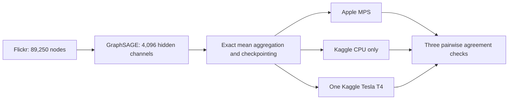

# Flickr 4,096-channel benchmark

- Status: Ready for execution
- POC 13: Flickr GraphSAGE on Kaggle CPU only
- POC 14: the identical workload on one Kaggle Tesla T4
- Third environment: host-native Apple MPS with CPU fallback disabled
- Scope: comparison only; no Neo4j import

This workload retains the full open Flickr graph and increases each hidden
GraphSAGE layer to 4,096 channels. MPS, CPU, and CUDA use FP32, the same data
split, seed, optimizer, ten requested epochs, and early-stopping patience four.

All environments use exact mean aggregation in fixed 32,768-edge chunks and
pure-PyTorch activation checkpointing. The graph, width, layer formula, and
trainable parameters are unchanged; the forward blocks are recomputed during
backward to bound temporary storage. No compiled CUDA extension is introduced.

## Acceptance checks

- Every artifact passes schema and detached SHA-256 validation.
- Model and dataset metadata match exactly across MPS, CPU, and CUDA.
- All three predicted-class pairs agree on at least 95% of nodes.
- The CPU runner proves CUDA unavailable and records Linux `wait4` resource use.
- The CUDA runner proves one-T4 execution and at least 10 GiB peak allocation.
- The MPS runner proves MPS availability with CPU fallback disabled.
- Each Kaggle wrapper is pinned to the executable source revision it runs.

The final comparisons will be committed under `results/` only after every gate
passes. These artifacts are not eligible for Neo4j import.
