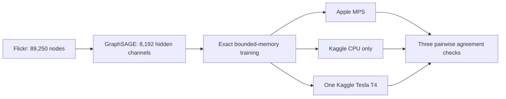

# Flickr 8,192-channel benchmark

- Status: MPS and T4 pass; Kaggle CPU version 1 running
- POC 15: Flickr GraphSAGE on Kaggle CPU only
- POC 16: the identical workload on one Kaggle Tesla T4
- Third environment: host-native Apple MPS with CPU fallback disabled
- Scope: comparison only; no Neo4j import

This workload retains the complete open Flickr graph and increases both hidden
GraphSAGE layers to 8,192 channels. All environments use FP32 master weights,
the same data split, seed, state-free SGD optimizer, eight requested epochs,
and early-stopping patience three. All environments use learning rate 0.1 and
maximum gradient norm 1.0. MPS uses BF16 activations;
checkpoint tensors are offloaded to pageable CPU memory on MPS and T4. Kaggle
CPU and T4 use FP32 activations. T4 also uses expandable CUDA allocator
segments to avoid fragmentation. The model has 142,540,807 trainable
parameters.



All environments use exact destination-node-chunked mean aggregation, hidden-
and output-layer checkpointing, L2-normalized hidden node embeddings, and
CPU-retained best-model state. State-free SGD avoids paging two additional
full-model Adam moment tensors on the 16 GB laptop. Kaggle uses
1,024-destination-node workspaces. MPS uses 256-node workspaces to fit 16 GB
unified memory. Workspace sizes are execution metadata, not model parameters;
the graph, layer formula, FP32 master weights, loss, optimizer, and trainable
parameter count remain identical. Activation precision is recorded per backend.
MPS saved-tensor offload is also recorded as execution metadata.

## Verified results so far

| Environment | Training time | Test accuracy | Result |
| --- | ---: | ---: | --- |
| Apple MPS | 4,822.456 s | 42.343% | PASS |
| Kaggle Tesla T4 | 521.977 s | 42.343% | PASS |
| Kaggle CPU only | Running | Pending | Pending |

The T4 is 9.239 times faster than MPS for training and used 13,618,750,976
bytes (12.68 GiB) peak CUDA allocation. MPS and T4 agree on the predicted class
for all 89,250 nodes. The compact partial record is
[`results/flickr-8192-mps-vs-t4.json`](../../results/flickr-8192-mps-vs-t4.json).

## Acceptance checks

- Every artifact passes schema and detached SHA-256 validation.
- Model and dataset metadata match exactly across MPS, CPU, and CUDA.
- Each artifact records its backend-appropriate execution workspaces.
- All three predicted-class pairs agree on at least 95% of nodes.
- The CPU runner proves CUDA unavailable and records Linux `wait4` resource use.
- The CUDA runner proves one-T4 execution and at least 12 GiB peak allocation.
- The MPS runner proves MPS availability with CPU fallback disabled.
- Each Kaggle wrapper is pinned to the executable source revision it runs.

## Reproduction

```bash
kaggle kernels push -p kaggle/flickr-8192-cpu
kaggle kernels push -p kaggle/flickr-8192-cuda
bun run poc:mps:flickr:8192 -- --force

bun run poc:compare:three -- \
  .artifacts/flickr-8192-mps/flickr-8192-mps-result.json \
  .artifacts/flickr-8192-cpu/flickr-8192-cpu-result.json \
  .artifacts/flickr-8192-cuda/flickr-8192-cuda-result.json \
  --cpu-resource-usage \
  .artifacts/flickr-8192-cpu/flickr-8192-cpu-resource-usage.json \
  --minimum-agreement 0.95 \
  --verify-kaggle-status
```
