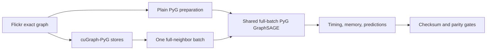

# Full-batch PyG versus cuGraph-PyG

- Status: Verified PASS on 2026-09-12
- POC 18: exact full-batch Flickr GraphSAGE with plain PyG on one Tesla T4
- POC 19: cuGraph-PyG full-neighbor materialization followed by the identical
  full-batch PyG training path on one Tesla T4
- Scope: CUDA comparison only; database-free and comparison-only

Both private Kaggle version-2 jobs use source revision
`723e0b5e0b62b8d203496dd67db2e6129c56a9d2`, PyTorch 2.10.0 with CUDA 12.8,
PyG 2.7.0, and the RAPIDS 26.2 package family. The runner verifies all 89,250
nodes, all 899,756 edges as an exact multiset, features, labels, and masks before
calling the same full-batch training function.



## Result

| Measurement | Plain PyG | cuGraph-PyG materialization |
| --- | ---: | ---: |
| Backend preparation | 0.167s | 11.480s |
| Identical training region | 6.712s | 6.238s |
| Preparation plus training | 6.879s | 17.718s |
| Test accuracy | 42.3475% | 42.3475% |
| Training-region PyTorch CUDA allocation | 2.214 GiB | 2.396 GiB |
| Training-region PyTorch CUDA reservation | 2.396 GiB | 2.566 GiB |
| Predicted-class agreement | 100% | 100% |

The cuGraph-inclusive path took 2.576 times as long. The cuGraph-prepared run's
training region was 7.1% shorter, but both variants execute the same PyG
`SAGEConv` code after preparation; that small difference is ordinary run
variance and is not cuGraph convolution acceleration. Flickr already fits in
one full batch, so cuGraph's storage and sampler setup adds cost without solving
a capacity problem.

Backend preparation starts after dataset loading. Plain preparation clones and
verifies the graph; cuGraph preparation additionally initializes communicators,
constructs the stores and loader, materializes one batch, and converts it back
to an ordinary exact PyG graph. The training timer starts later, after device
transfer, model construction, and warm-up inference. “Preparation plus
training” excludes dependency installation and dataset loading. PyTorch CUDA
peak counters are reset after preparation, so they describe training through
final inference and do not measure cuGraph/RMM setup memory.

The cuGraph path uses one `NeighborLoader` batch with fanout `[-1]` and all
89,250 nodes as seeds. cuGraph-PyG 26.2.1 otherwise defaults to 32,768 local
seeds per call for unknown full-neighbor expansion, which is smaller than this
batch and produces a zero effective split. The verified runner therefore sets
and records `local_seeds_per_call=89250`.

The committed compact proof is
[`results/kaggle-flickr-fullbatch-pyg-vs-cugraph-pyg-t4.json`](../../results/kaggle-flickr-fullbatch-pyg-vs-cugraph-pyg-t4.json).

## Reproduction

```bash
kaggle kernels push -p kaggle/flickr-fullbatch-pyg-cuda
kaggle kernels push -p kaggle/flickr-fullbatch-cugraph-pyg-cuda
kaggle kernels output andird/ml-poc-18-flickr-full-batch-pyg-t4/2 \
  -p .artifacts/fullbatch-pyg-v2 --force
kaggle kernels output andird/ml-poc-19-flickr-full-batch-cugraph-pyg-t4/2 \
  -p .artifacts/fullbatch-cugraph-v2 --force
bun run poc:kaggle:fullbatch:compare -- \
  .artifacts/fullbatch-pyg-v2/flickr-fullbatch-pyg-result.json \
  .artifacts/fullbatch-cugraph-v2/flickr-fullbatch-cugraph-pyg-result.json \
  --verify-kaggle-status --force
```
