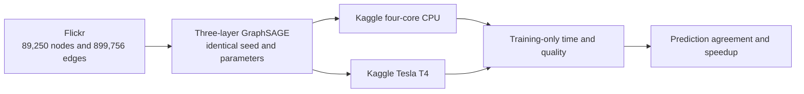

# Flickr Kaggle benchmark

- POC 7: Flickr GraphSAGE on Kaggle CPU only
- POC 8: identical Flickr GraphSAGE on Kaggle Tesla T4
- Status: prepared; remote execution pending

This pair is large enough to compare compute rather than merely prove device
compatibility. Flickr has 89,250 nodes, 899,756 edges, 500 node features, seven
classes, and official train/validation/test masks. The model is a three-layer,
full-batch GraphSAGE with two 256-channel hidden layers.

## Measurement boundary

- Timing starts after dataset loading, device transfer, model construction, and
  one untimed warm-up inference.
- Timing covers training plus the validation pass performed after each epoch.
- Final inference and JSON serialization are outside the timed region.
- Both jobs use 30 requested epochs, patience 8, seed 42, Adam, the same masks,
  and the same source commit.
- The output records node predictions, quality metrics, elapsed training time,
  model size, framework versions, and GPU peak allocated memory where relevant.
- These artifacts are comparison-only and are not accepted by the Neo4j
  importer.

## Sources

- [PyG Flickr dataset implementation](https://github.com/pyg-team/pytorch_geometric/blob/master/torch_geometric/datasets/flickr.py)
- [PyG GraphSAGE operator](https://pytorch-geometric.readthedocs.io/en/latest/generated/torch_geometric.nn.conv.SAGEConv.html)
- [Kaggle notebook resources](https://www.kaggle.com/docs/notebooks)
