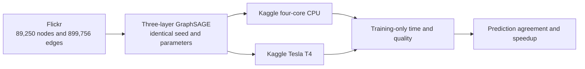

# Flickr Kaggle benchmark

- POC 7: Flickr GraphSAGE on Kaggle CPU only
- POC 8: identical Flickr GraphSAGE on Kaggle Tesla T4
- Status: Verified PASS on 2026-09-05

This pair is large enough to compare compute rather than merely prove device
compatibility. Flickr has 89,250 nodes, 899,756 edges, 500 node features, seven
classes, and official train/validation/test masks. The model is a three-layer,
full-batch GraphSAGE with two 256-channel hidden layers.

## Measurement boundary

- Timing starts after dataset loading, device transfer, model construction, and
  one untimed warm-up inference.
- Timing covers training plus the validation pass performed after each epoch.
- Final inference and JSON serialization are outside the timed region.
- Both jobs use 30 requested epochs, patience 8, seed 42, Adam, the same masks,
  and the same source commit.
- The output records node predictions, quality metrics, elapsed training time,
  model size, framework versions, and GPU peak allocated memory where relevant.
- CPU version 4 wraps the complete pinned Python runner with Linux `wait4`; its
  resource evidence records maximum resident memory and average process CPU.
- GPU peak memory resets PyTorch's active-device allocator counter before the
  workload, then reads peak allocated bytes after final inference. It does not
  include reserved cache, CUDA context, other processes, or GPU utilization.
- These artifacts are comparison-only and are not accepted by the Neo4j
  importer.

## Verified evidence

| Check | Kaggle CPU | Kaggle Tesla T4 |
| --- | ---: | ---: |
| Kernel | `andird/ml-poc-7-flickr-graphsage-cpu` v4 | `andird/ml-poc-8-flickr-graphsage-cuda` v2 |
| Processor | Intel Xeon 2.20 GHz, 4 cores | Tesla T4, capability 7.5 |
| Training time | 246.061 seconds | 6.313 seconds |
| Epochs completed; best epoch | 24; 16 | 24; 16 |
| Validation accuracy | 42.90% | 42.38% |
| Test accuracy | 42.81% | 42.35% |
| Model parameters | 391,175 | 391,175 |

The T4 completed the measured region 38.974 times faster. Across all 89,250
nodes, 88,125 predicted classes matched, or 98.7395%. Both ran Python 3.12.13,
PyTorch 2.10.0, PyG 2.8.0.post1, and source revision
`95ccbccd57dc4ec9f0c7c9f143dc941e615dc520`. The T4 peak allocated PyTorch
memory was approximately 2.38 GB.

The CPU runner's maximum resident set was 2,936,729,600 bytes, or 2.94 GB
decimal (2.74 GiB). Its complete-runner wall time was 295.19 seconds and average
process CPU was 160.267%, equivalent to about 1.60 fully busy cores. That CPU
percentage is not a sampled peak. Kaggle assigned a different processor than an
earlier run, demonstrating why the CPU model is part of the proof.

## Sources

- [PyG Flickr dataset implementation](https://github.com/pyg-team/pytorch_geometric/blob/master/torch_geometric/datasets/flickr.py)
- [PyG GraphSAGE operator](https://pytorch-geometric.readthedocs.io/en/latest/generated/torch_geometric.nn.conv.SAGEConv.html)
- [Kaggle notebook resources](https://www.kaggle.com/docs/notebooks)
