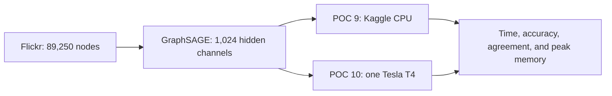

# Flickr wide Kaggle benchmark

- Status: Verified PASS on 2026-09-05
- POC 9: wide Flickr GraphSAGE on Kaggle CPU only
- POC 10: the identical workload on one Kaggle Tesla T4
- Scope: timing and resource comparison only; no Neo4j import

This pair increases the GraphSAGE hidden width from 256 to 1,024 channels. It
keeps the same open Flickr graph, three message-passing layers, split, seed,
optimizer, and precision on CPU and CUDA. Twenty epochs are requested with
early stopping after six epochs without improvement.



## Acceptance checks

- The CPU kernel rejects a runtime where CUDA is available.
- The CUDA kernel requires `cuda:0` and a single T4 metadata profile.
- CPU and GPU runners use identical model and training parameters.
- Both artifacts must pass schema and detached SHA-256 validation.
- Predicted classes must agree on at least 95% of nodes.
- Both runs must exceed 30% test accuracy and reduce training loss.
- The CUDA run must allocate at least 4 GiB at peak. A lower peak fails POC 10.
- GPU evidence includes peak allocated memory, peak reserved memory, device
  capacity, and each peak as a fraction of capacity.
- CPU evidence includes maximum resident set, wall time, CPU time, and average
  process CPU from Linux `wait4`.

The 4 GiB CUDA threshold is deliberately higher than POC 8's measured 2.38 GB
peak. It is a lower bound, not a promise that the T4's entire 16 GB will be used.
The configuration avoids mixed precision, custom kernels, and multi-GPU logic so
the comparison remains FP32 and portable to the future H200 environment.

## Verified evidence

| Check | Kaggle CPU | Kaggle Tesla T4 |
| --- | ---: | ---: |
| Kernel | `andird/ml-poc-9-flickr-wide-graphsage-cpu` v1 | `andird/ml-poc-10-flickr-wide-graphsage-cuda` v1 |
| Processor | AMD EPYC 7B12, 4 cores | Tesla T4, capability 7.5 |
| Training time | 599.418 seconds | 17.168 seconds |
| Epochs completed; best epoch | 20; 14 | 18; 12 |
| Validation accuracy | 42.37% | 42.38% |
| Test accuracy | 42.33% | 42.33% |
| Model parameters | 3,137,543 | 3,137,543 |
| Peak measured memory | 8.01 GB process RSS | 6.88 GB allocated; 9.76 GB reserved |

The T4 completed the measured training region 34.915 times faster. Across all
89,250 nodes, 89,161 predicted classes matched, or 99.9003%. Both jobs ran
Python 3.12.13, PyTorch 2.10.0, PyG 2.8.0.post1, and source revision
`d4115e3e408f992354a7ceced768d3e19977b54b`.

The T4 exposed 15.64 GB of device memory. PyTorch's peak allocated memory was
6.88 GB, or 44.0% of capacity, and its peak reserved memory was 9.76 GB, or
62.4%. Peak allocation was about 2.9 times POC 8's 2.38 GB. These allocator
figures exclude CUDA context and unrelated processes.

The complete CPU runner used 8.01 GB maximum RSS and took 660.248 seconds wall
time. Its average process CPU was 169.281%, equivalent to about 1.69 fully busy
cores. CPU RSS and CUDA allocator memory describe different memory domains and
must not be treated as directly equivalent.

## Reproduction

```bash
kaggle kernels push -p kaggle/flickr-wide-cpu
kaggle kernels push -p kaggle/flickr-wide-cuda
```

After both immutable versions complete, download their outputs and compare them:

```bash
bun run poc:kaggle:compare -- \
  .artifacts/flickr-wide-cpu/flickr-wide-cpu-result.json \
  .artifacts/flickr-wide-cuda/flickr-wide-cuda-result.json \
  --cpu-resource-usage \
  .artifacts/flickr-wide-cpu/flickr-wide-cpu-resource-usage.json \
  --minimum-agreement 0.95 \
  --verify-kaggle-status \
  --output results/kaggle-flickr-wide-cpu-vs-cuda.json
```

The final result is comparison evidence only. It must not be imported into
Neo4j.
