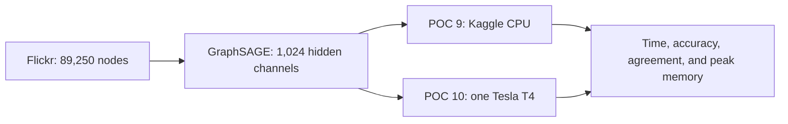

# Flickr wide Kaggle benchmark

- Status: Ready for private Kaggle execution
- POC 9: wide Flickr GraphSAGE on Kaggle CPU only
- POC 10: the identical workload on one Kaggle Tesla T4
- Scope: timing and resource comparison only; no Neo4j import

This pair increases the GraphSAGE hidden width from 256 to 1,024 channels. It
keeps the same open Flickr graph, three message-passing layers, split, seed,
optimizer, and precision on CPU and CUDA. Twenty epochs are requested with
early stopping after six epochs without improvement.



## Acceptance checks

- The CPU kernel rejects a runtime where CUDA is available.
- The CUDA kernel requires `cuda:0` and a single T4 metadata profile.
- CPU and GPU runners use identical model and training parameters.
- Both artifacts must pass schema and detached SHA-256 validation.
- Predicted classes must agree on at least 95% of nodes.
- Both runs must exceed 30% test accuracy and reduce training loss.
- The CUDA run must allocate at least 4 GiB at peak. A lower peak fails POC 10.
- GPU evidence includes peak allocated memory, peak reserved memory, device
  capacity, and each peak as a fraction of capacity.
- CPU evidence includes maximum resident set, wall time, CPU time, and average
  process CPU from Linux `wait4`.

The 4 GiB CUDA threshold is deliberately higher than POC 8's measured 2.38 GB
peak. It is a lower bound, not a promise that the T4's entire 16 GB will be used.
The configuration avoids mixed precision, custom kernels, and multi-GPU logic so
the comparison remains FP32 and portable to the future H200 environment.

## Ready commands

```bash
kaggle kernels push -p kaggle/flickr-wide-cpu
kaggle kernels push -p kaggle/flickr-wide-cuda
```

After both immutable versions complete, download their outputs and compare them:

```bash
bun run poc:kaggle:compare -- \
  .artifacts/flickr-wide-cpu/flickr-wide-cpu-result.json \
  .artifacts/flickr-wide-cuda/flickr-wide-cuda-result.json \
  --cpu-resource-usage \
  .artifacts/flickr-wide-cpu/flickr-wide-cpu-resource-usage.json \
  --minimum-agreement 0.95 \
  --verify-kaggle-status \
  --output results/kaggle-flickr-wide-cpu-vs-cuda.json
```

The final result is comparison evidence only. It must not be imported into
Neo4j.
