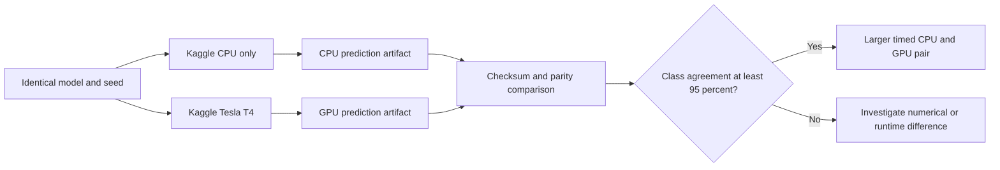

# Kaggle CPU comparison

- POC 5: Karate Club on Kaggle CPU only
- POC 6: pinned WikiCS on Kaggle CPU only
- Status: Verified PASS on 2026-09-05

Kaggle supports CPU-only notebooks. These two private jobs disable GPU and run
the same datasets, model parameters, seeds, and training code as POCs 3 and 4.
They export checksummed artifacts for comparison only and never connect to
Neo4j. Both comparisons passed the 95% agreement gate.

## Acceptance

- The CPU kernel must report `device=cpu`, no CUDA availability, and its CPU
  model.
- The corresponding CPU and GPU artifacts must have identical dataset metadata
  and model parameters.
- At least 95% of node classes must agree. Score differences and model-quality
  metrics are recorded; bit-identical floating-point scores are not required.
- Full artifacts stay in ignored `.artifacts/` storage. Compact results are
  committed under `results/`.

The CPU environment currently provides four CPU cores and 30 GB RAM. Kaggle
CPU and GPU sessions have a 12-hour limit. A larger pair will record training
time because the existing artifacts were designed for portability and did not
time training.

## Verified evidence

| Check | Karate CPU versus T4 | WikiCS CPU versus T4 |
| --- | ---: | ---: |
| Kaggle CPU kernel | `andird/ml-poc-5-karate-cpu` v1 | `andird/ml-poc-6-wikics-cpu` v1 |
| Nodes compared | 34 | 11,701 |
| Class agreement | 100% | 97.7523% |
| CPU test accuracy | 76.47% | 79.01% |
| T4 test accuracy | 76.47% | 79.32% |
| Mean score difference | 0.000000040 | 0.004768312 |

The framework releases match: Python 3.12.13, PyTorch 2.10.0, and PyG
2.8.0.post1. CPU uses the `+cpu` PyTorch build; T4 uses `+cu128`. The successful
gate triggered the larger Flickr benchmark in POCs 7 and 8.

## Sources

- [Kaggle notebook resources](https://www.kaggle.com/docs/notebooks)
- [Kaggle kernel metadata](https://github.com/Kaggle/kaggle-cli/blob/main/docs/kernels_metadata.md)
