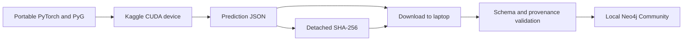

# Kaggle CUDA proofs

- POC 3: Karate Club on one Kaggle NVIDIA GPU
- POC 4: pinned WikiCS on one Kaggle NVIDIA GPU
- Status: implemented; remote execution pending

These jobs prove ordinary single-device CUDA portability before access to the
self-managed H200 cluster. They use Kaggle's free notebook GPU allocation and
run no Neo4j process.



## Four-POC matrix

| POC | Dataset | Compute | Neo4j behavior |
| --- | --- | --- | --- |
| 1 | Karate Club | Laptop MPS or CPU | Full local round trip |
| 2 | WikiCS | Laptop MPS or CPU | Full local round trip |
| 3 | Karate Club | Kaggle CUDA | Export then local import |
| 4 | WikiCS | Kaggle CUDA | Export then local import |

## Artifact boundary

Each GPU job requires `cuda:0`; it fails instead of falling back to CPU. The
result records the exact source commit, CUDA device, framework versions,
metrics, every node's class scores, dataset identity, and model parameters. A
detached SHA-256 binds the download to that JSON file.

The local importer accepts only the two known POC IDs. Before any database
write, it checks the checksum, schema version, pinned dataset identity, CUDA
evidence, accuracy floor, exact ordered node set, finite normalized scores, and
argmax prediction. CUDA predictions use separate `cuda_*` properties, preserving
the laptop outputs.

```bash
# After downloading both JSON and .sha256 files
./poc/import_kaggle_result.py .artifacts/karate/karate-cuda-result.json
./poc/import_kaggle_result.py .artifacts/wikics/wikics-cuda-result.json
```

Kaggle currently documents free GPU notebooks, 12-hour sessions, and weekly GPU
quotas that vary with demand. Both kernels request `NvidiaTeslaT4`, because the
current default Kaggle PyTorch image does not support the older P100's compute
capability. The artifacts still record the actual assigned GPU. These proofs do
not validate H200-specific precision, scaling, interconnect, or performance.

## Sources

- [Kaggle notebook resources](https://www.kaggle.com/docs/notebooks)
- [Kaggle efficient GPU usage](https://www.kaggle.com/docs/efficient-gpu-usage)
- [Neo4j transaction-log retention](https://neo4j.com/docs/operations-manual/current/database-internals/transaction-logs/)
