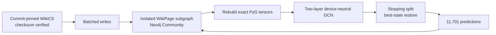

# Larger WikiCS end-to-end proof

- Status: Verified PASS on CPU and MPS on 2026-09-05
- Purpose: a realistic laptop-sized proof kept separate from the minimal Karate
  smoke test

## Dataset and model

WikiCS is a Wikipedia hyperlink graph published by its upstream repository
under the MIT license. The runner pins upstream commit
`f5207315d649377f936edb66d7d93f5342f01d81` and verifies the raw file SHA-256
before use.

| Item | Verified size |
| --- | ---: |
| Nodes | 11,701 |
| Canonical Neo4j relationships | 216,123 |
| Undirected PyG edge entries | 431,726 |
| Features per node | 300 |
| Classes | 10 |
| Dataset splits | 20 |
| Selected split | 0 |
| Training / validation / stopping / test nodes | 580 / 1,769 / 3,505 / 5,847 |

The model is a full-batch two-layer GCN: 300 inputs, 64 hidden channels with
ReLU and 0.25 dropout, then 10 output classes. It trains with Adam, uses the
upstream stopping mask for model selection, restores the best state, and reports
validation and test accuracy. A 50% accuracy floor proves generalization beyond
the integration-only checks.



## Database representation

Each `WikiPage` stores its 300 features, category, selected split masks, dataset
commit, and prediction output. Each undirected connection is stored once as a
canonical `CONNECTED_TO` relationship; self-loops are preserved. Reading expands
non-loop relationships in both directions and verifies exact tensors.

The POC uses its own `wikics-gcn-neo4j-v1` identifier and `WikiPage` label, so it
does not replace the Karate subgraph. Node creation, relationship creation,
prediction updates, and cleanup are bounded batches. This is required by the
2 GB local Neo4j container; a single cleanup transaction exceeded its transaction
memory pool during testing.

## Pass conditions

1. The raw dataset matches the pinned SHA-256.
2. Neo4j is the expected version-pinned Community server.
3. All nodes, canonical relationships, features, labels, masks, and expanded
   edges survive the Neo4j round trip exactly.
4. The actual tensor/model device matches the selected CPU, MPS, or CUDA profile.
5. Training loss decreases, losses stay finite, and the restored model reaches
   at least 50% on both validation and test masks.
6. All 11,701 predictions and 10 class scores are persisted.
7. A second full run safely replaces only the WikiCS subgraph in batches.

## Verified evidence

| Check | CPU | MPS |
| --- | ---: | ---: |
| Status | PASS | PASS |
| Best epoch | 84 | 89 |
| Initial training loss | 2.301570 | 2.301570 |
| Restored training loss | 0.39717 | 0.40811 |
| Best stopping loss | 0.70724 | 0.70632 |
| Validation accuracy | 82.02% | 81.91% |
| Test accuracy | 79.01% | 79.19% |
| Predictions persisted | 11,701 | 11,701 |

Small numeric differences between backends are expected. Accuracy is a proof
threshold, not a benchmark claim; standardized WikiCS evaluation averages all
20 splits and is outside this integration proof.

## Run the proof

The first run downloads about 83 MB into ignored `.data/wikics/` storage.
Execute the file matching the environment:

```bash
./poc/run_wikics_macos_mps.py
./poc/run_wikics_cpu.py
./poc/run_wikics_linux_cuda.py
```

The CUDA entry point contains no CUDA-specific model code and awaits later
NVIDIA validation. Run `bun run poc:wikics:verify` for a non-mutating database
check. Optional trailing CLI flags override profile defaults.

## Sources

- [PyG WikiCS documentation](https://pytorch-geometric.readthedocs.io/en/2.8.0/generated/torch_geometric.datasets.WikiCS.html)
- [Pinned WikiCS upstream snapshot](https://github.com/pmernyei/wiki-cs-dataset/tree/f5207315d649377f936edb66d7d93f5342f01d81)
- [WikiCS upstream MIT license](https://github.com/pmernyei/wiki-cs-dataset/blob/f5207315d649377f936edb66d7d93f5342f01d81/LICENSE)
