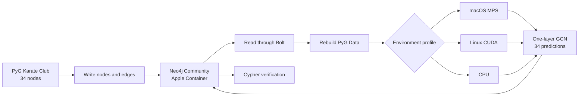

# Minimal local end-to-end proof

- Status: Verified PASS on 2026-09-05
- Target: Apple M2 Pro laptop with MPS and Apple Container

## Dataset

Use PyTorch Geometric's bundled Zachary Karate Club graph. It requires no
separate dataset download and contains:

| Item | Size |
| --- | ---: |
| Nodes | 34 |
| Directed PyG edge entries | 156 |
| Undirected Neo4j relationships | 78 |
| Node features | 34 per node |
| Classes | 4 |
| Labeled training nodes | 4 |

The dataset is encoded directly in the MIT-licensed PyG source. It is preferable
to Cora for this proof because it is smaller and introduces no download step.

## Proof flow



## Smallest stack

| Component | Verified choice |
| --- | --- |
| Python | 3.14.7 in `.venv` |
| Python packages | PyTorch 2.14.0, PyG 2.8.0.post1, Neo4j Driver 6.3.0 |
| Dataset | `torch_geometric.datasets.KarateClub` |
| GNN | One `GCNConv(34, 4)` layer with a parameterized device runner |
| Database | `docker.io/library/neo4j:2026.07.1` Community |
| Runtime | Apple Container 1.3.1, native Linux ARM64 |
| Container resources | 2 CPUs, 2 GB memory, 2 GB named volume |
| Network | Bolt only on `127.0.0.1:7687` |
| Secret | `NEO4J_AUTH` supplied through an untracked environment file |

The Python test runs natively on macOS. Only Neo4j runs inside Apple Container.
Host Java is not involved.

## Graph representation

Each `KarateMember` node stores `member_id`, 34 floating-point features, the
known community label, and whether it is one of the four training nodes. Each
undirected connection is stored once as `KNOWS`. Python expands the 78 Neo4j
relationships back into 156 directed PyG edge entries.

After training, the test writes `predicted_community` and four class scores back
to every node.

## Pass conditions

1. The Neo4j driver connects to the version-pinned Community container.
2. Neo4j contains exactly 34 POC nodes and 78 `KNOWS` relationships.
3. Data read from Neo4j reconstructs tensors with shapes `[34, 34]` and
   `[2, 156]`, four classes, and four training nodes.
4. The resolved device matches the requested profile. For the MPS proof, model
   parameters, graph tensors, and output remain on MPS with fallback disabled.
5. The GCN output shape is `[34, 4]`, loss is finite, backward propagation and
   an optimizer step succeed, and final training loss is below initial loss.
6. Cypher reads predictions and four scores for all 34 nodes.
7. A repeated run replaces only its own POC subgraph and produces the same
   structural counts.

Prediction accuracy is informational, not a pass condition. This proof checks
integration and device execution, not model quality.

## Verified evidence

Two consecutive full runs produced the same result:

| Check | Observed result |
| --- | --- |
| Status | PASS |
| MPS execution | Model, features, and output on `mps`; fallback disabled |
| CPU execution | Same runner passed on `cpu` |
| CUDA entry point | Ready; execution awaits NVIDIA validation |
| Neo4j identity | Community 2026.07.1 |
| Graph | 34 nodes, 78 stored relationships, 156 reconstructed edge entries |
| Tensor shapes | Features `[34, 34]`; output `[34, 4]` |
| Training | 100 epochs; loss 1.430153 to 0.050713 |
| Prediction write-back | 34 of 34 nodes |
| Informational accuracy | 0.764706 across all nodes |

The container definition was then deleted and recreated with the same named
volume. A read-only check passed with all 34 nodes, 78 relationships, exact
source tensors, and 34 prediction payloads still present.

## Run the proof

With Neo4j reachable, execute the file matching the environment:

```bash
./poc/run_macos_mps.py
./poc/run_cpu.py
./poc/run_linux_cuda.py
```

Each file supplies device, epochs, seed, learning rate, and weight decay to the
same runner. Optional trailing flags override profile defaults. For example,
`./poc/run_cpu.py --epochs 20 --learning-rate 0.05` is verified. Run
`bun run poc:verify` for a non-mutating persistence check. The scripts never
print the database password. Direct execution automatically selects the project
`.venv` when it exists.

The shared implementation is
[poc/karate_gnn_neo4j.py](../../poc/karate_gnn_neo4j.py), with environment
profiles in `poc/run_macos_mps.py`, `poc/run_cpu.py`, and
`poc/run_linux_cuda.py`,
with exact direct dependencies in
[requirements-poc.txt](../../requirements-poc.txt). The ignored secret file is
created with `bun run poc:secret`.

## Excluded from this proof

- Neo4j Browser, APOC, Graph Data Science, Enterprise Edition, and clustering.
- Jupyter, large datasets, batching, sampling, mixed precision, and tuning.
- Apple Container GPU access; MPS remains host-native.
- Actual CUDA and H200 execution, performance, and parity testing.

## Sources

- [PyG Karate Club dataset](https://pytorch-geometric.readthedocs.io/en/latest/generated/torch_geometric.datasets.KarateClub.html)
- [PyG bundled dataset source](https://pytorch-geometric.readthedocs.io/en/latest/_modules/torch_geometric/datasets/karate.html)
- [PyG minimal installation](https://pytorch-geometric.readthedocs.io/en/latest/install/installation.html)
- [PyTorch MPS backend](https://docs.pytorch.org/docs/stable/notes/mps.html)
- [Apple Container command reference](https://github.com/apple/container/blob/main/docs/command-reference.md)
- [Apple Container volumes](https://github.com/apple/container/blob/main/docs/volumes.md)
- [Neo4j Community container](https://neo4j.com/docs/operations-manual/current/docker/introduction/)
