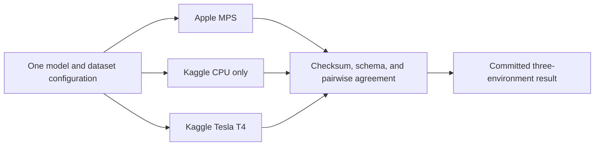

# Three-environment GNN comparison

- Status: Verified PASS on 2026-09-06
- Environments: Apple M2 Pro MPS, Kaggle CPU only, and Kaggle Tesla T4 CUDA
- Coverage: every logical GNN workload
- Agreement gate: at least 95% for every environment pair

The fourteen numbered execution proofs represent six model-and-dataset workloads.
Each workload now has checksummed prediction evidence from all three compute
environments. MPS runs are host-native with CPU fallback disabled. Kaggle CPU
runs reject CUDA, and Kaggle GPU runs require a single Tesla T4.

## Verified matrix

| Workload | MPS vs CPU | MPS vs T4 | CPU vs T4 | Training time: MPS / CPU / T4 |
| --- | ---: | ---: | ---: | ---: |
| Karate GCN | 100.0000% | 100.0000% | 100.0000% | Not timed comparably |
| WikiCS GCN | 97.8463% | 98.1540% | 97.7523% | Not timed comparably |
| Flickr GraphSAGE 256 | 98.7126% | 99.9686% | 98.7395% | 38.10s / 246.06s / 6.31s |
| Flickr GraphSAGE 1,024 | 99.3232% | 99.3580% | 99.9003% | 158.84s / 599.42s / 17.17s |
| Flickr GraphSAGE 2,048 | 99.9238% | 99.9272% | 99.8723% | 576.98s / 1,521.33s / 56.58s |
| Flickr GraphSAGE 4,096 | 99.5664% | 99.2807% | 99.3669% | 448.47s / 6,828.02s / 177.87s |

For Flickr-256, MPS was 6.458 times faster than Kaggle CPU and T4 was 6.035
times faster than MPS. For Flickr-1,024, MPS was 3.774 times faster than Kaggle
CPU and T4 was 9.252 times faster than MPS.

For Flickr-2,048, MPS was 2.637 times faster than Kaggle CPU and T4 was
10.198 times faster than MPS. The T4 was 26.888 times faster than Kaggle CPU.

For Flickr-4,096, MPS was 15.225 times faster than Kaggle CPU and T4 was 2.521
times faster than MPS. The T4 was 38.388 times faster than Kaggle CPU.

Karate and WikiCS Kaggle artifacts did not define a training-only timing
boundary, so their comparison is correctness-only. This is recorded as `null`,
not inferred from notebook duration.

## Proof boundary

Each committed result verifies:

- all three artifacts and detached SHA-256 files;
- exact workload IDs, dataset identity, and model configuration;
- MPS execution with CPU fallback disabled;
- Kaggle CPU-only and single-T4 metadata;
- all three pairwise prediction agreements;
- immutable Kaggle kernel status at comparison time.

The laptop currently uses Python 3.14.7 and PyTorch 2.14.0. Kaggle used Python
3.12.13 and the CPU/CUDA builds of PyTorch 2.10.0. The purpose is portable model
behavior across backends, not bit-identical framework environments or scores.

## Recorded results

- [`karate-mps-cpu-cuda.json`](../../results/karate-mps-cpu-cuda.json)
- [`wikics-mps-cpu-cuda.json`](../../results/wikics-mps-cpu-cuda.json)
- [`flickr-mps-cpu-cuda.json`](../../results/flickr-mps-cpu-cuda.json)
- [`flickr-wide-mps-cpu-cuda.json`](../../results/flickr-wide-mps-cpu-cuda.json)
- [`flickr-2048-mps-cpu-cuda.json`](../../results/flickr-2048-mps-cpu-cuda.json)
- [`flickr-4096-mps-cpu-cuda.json`](../../results/flickr-4096-mps-cpu-cuda.json)

Full prediction artifacts remain in ignored `.artifacts/` storage. Flickr and
CPU comparison artifacts are comparison-only and must not be imported into
Neo4j.
